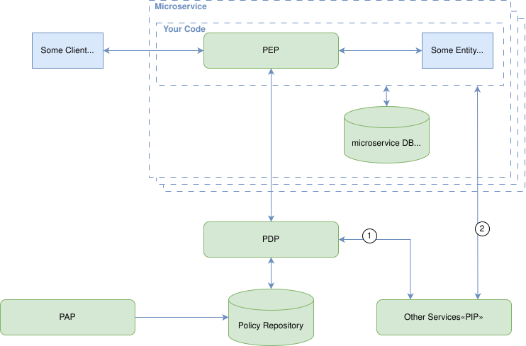

# Microservices Security Cheat Sheet

## Introduction

The microservice architecture is increasingly used to design and implement application systems in both cloud-based and on-premise environments, particularly for high-scale applications and services. However, it introduces a range of security challenges that must be addressed during both the design and implementation phases.

Two of the most critical security concerns are authentication and authorization. As such, it is essential for application security architects to understand and correctly apply architectural patterns that implement these concerns in microservices-based systems.

The goal of this cheat sheet is to describe common authentication and authorization patterns, highlight their trade-offs, and provide actionable recommendations. It also outlines common pitfalls to avoid when applying these patterns in practice.

## Authorization Reference Architecture

To lay the foundation for the patterns described in this cheat sheet, this section introduces the general building blocks of an authorization system, based on [NIST SP 800-162](https://nvlpubs.nist.gov/nistpubs/SpecialPublications/NIST.SP.800-162.pdf). While that standard focuses on Attribute-Based Access Control (ABAC), the architectural components it defines are relevant to nearly any access control system.

These functional components are:

* **Policy Administration Point (PAP):** Manages policies—offering tools for writing, testing, and updating access control logic.
* **Policy Decision Point (PDP):** Evaluates policies and computes decisions about access based on the incoming request and relevant attributes.
* **Policy Enforcement Point (PEP):** Intercepts requests and enforces the access decision provided by the PDP.
* **Policy Information Point (PIP):** Supplies attribute data or contextual information that the PDP requires to evaluate a policy.

### A Story to Ground the Concepts

Imagine Alice wants to read an article on her favorite blog platform. In this story:

* Alice is the subject.
* The article she wants to read is the object.
* The action ("read") is what she wants to perform.
* Her browser sends a request on her behalf to the platform’s backend services.

Now, let’s break down what happens:

Each time Alice interacts with the platform - by clicking a link, submitting a form, or opening a page - a request is made to one or more backend services. These services must decide: *Can Alice do this?* and more subtly: *What exactly is Alice allowed to do in this context?*

That decision process starts with the **Policy Enforcement Point (PEP)**. Think of the PEP as a gatekeeper - it sees the request and knows it must enforce some kind of access control. But it doesn't contain the logic to decide **what’s allowed**. Instead, it delegates that to the **Policy Decision Point (PDP)**.

The **PDP** evaluates the request against a set of policies. These policies might include conditions like:

* Alice must be logged in.
* Alice must have an active subscription.
* Alice can only read the full article if her subscription level is "Premium".

To perform this evaluation, the PDP often needs more information than what’s in Alice’s request. For example, it may need to know:

* Alice’s subscription status,
* The article’s visibility flags.
* ...

This is where the **Policy Information Point (PIP)** comes in. The PIP retrieves additional attributes from user directories, databases, metadata services, etc., and supplies them to the PDP as needed.

But here’s where a crucial detail often gets missed: the PDP doesn't always answer a **closed question** like “yes” or “no”. In many cases, the PDP may answer **open questions**, like:

* Alice can read the article, but only the excerpt.
* Alice can read the full article if her subscription is Premium or if the article is marked as public.
* Alice can read up to three full articles per day on a free plan.
* Alice can read that set of articles

In these cases, the PDP returns not just a binary decision, but a decision along with **obligations, conditions, or structured attributes** that describe *how* access is permitted - such as what parts of a resource are visible, or what usage limits apply.

The PEP then takes that decision and enforces it - meaning the request is either allowed to proceed to the protected resource or is blocked. Enforcement is binary: permit or deny. If the decision includes additional data, it is up to downstream components, such as business logic or resource handlers to interpret and apply those, for example, by shaping the response or limiting available actions.

However, there is one essential prerequisite: the system must know who the subject is, that is, it must verify that Alice is indeed Alice. This is the domain of authentication. Without it, the PEP has no basis on which to enforce access decisions. Authentication is therefore foundational, which is why we begin by examining authentication patterns and approaches.

### First-Party vs. Third-Party Authorization

When it comes to authentication and authorization, we have to differentiate between first-party and third-party contexts:

* **First Party:** When the subject (given the story above - Alice) wants to access specific objects (like the article). The subject may own the object (like if the article was previously written by Alice), but doesn't need to (like when Alice wants to access an article written and published by somebody else).
* **Third Party:** When a subject wants to act on behalf of another entity and access objects belonging to that entity. Given the example from above, imagine there is another service that implements capabilities to check grammar and wording and provide suggestions for better reading flow to article authors; and our blog post service supports such integration by providing corresponding APIs. Here, Alice would delegate her rights - since she performs the decision on who is allowed to access her article, she takes the role of the PDP - to that third-party service. So, Alice is the PDP, the third-party service is the subject, the article is still the object, and the implementation of the API used by the third party plays the role of the PEP.

While exploring these contexts, it's important to understand that different protocols address different needs. Some protocols are tailored to the first-party context only, such as [Security Assertion Markup Language (SAML)](https://www.oasis-open.org/standard/saml/) or [Central Authentication Service (CAS)](https://apereo.github.io/cas/7.2.x/index.html), which are primarily designed for direct user authentication and carry attributes for authorization purposes within trusted domains. Others, like [Open Authorization (OAuth 2.0)](https://datatracker.ietf.org/doc/html/rfc6749), focus exclusively on the third-party context, enabling delegated access to resources on behalf of another party. And then there are protocols like [OpenID Connect (OIDC)](https://openid.net/specs/openid-connect-core-1_0.html) that support both contexts, combining identity information with delegated access.

What all these protocols have in common is that they define mechanisms to authenticate the involved parties. However, the details of how this authentication is performed - e.g., through passwords, certificates, or multi-factor methods - are not covered in this cheat sheet. Likewise, the protocols themselves are not the focus here; there are excellent existing cheat sheets for that purpose (which we will reference). Instead, this document emphasizes patterns: how different approaches to authentication and authorization are architecturally applied, and what implications they carry.

## Client Authentication Patterns

Authentication can be handled at different layers of a system’s architecture. Broadly speaking, we differentiate between Service-Level Authentication, where each service (or a component directly attached to it) is responsible for verifying identity, and Edge-Level Authentication, where authentication is handled by a shared component at the system boundary. Each approach comes with trade-offs in terms of scalability, consistency, and operational complexity.

### Service-Level Embedded Authentication

In this pattern, each service is responsible for handling authentication internally. This includes managing user identities and credentials, performing credential validation, and implementing login workflows. Common authentication methods used in this setup include username/password, API keys, and mutual TLS. All authentication logic and user data storage are embedded directly within the service, often through custom code or built-in libraries.

#### Pros

* **Team autonomy:** Each service is fully self-contained and does not rely on external systems for authentication.
* **Simplicity (for isolated systems):** No additional infrastructure is required to support authentication.
* **Customization:** Authentication behavior can be adapted to service-specific requirements without external constraints.

#### Cons

* **Inconsistency:** Authentication behavior, credential storage, and login flows differ across services, leading to fragmentation.
* **Security risk:** Critical authentication logic is duplicated and harder to audit or secure consistently.
* **Maintenance burden:** Changing authentication methods (e.g., introducing MFA) requires updates across all affected services.
* **Redundant identity stores:** Each service must securely manage its own user database and credential lifecycle.
* **Inconsistent user experience:** Fragmented authentication behavior and lack of SSO lead to inconsistent login flows and session handling across services.
* **Authentication orchestration:** Supporting multiple authentication configurations, including chaining protocols and subject-specific variations, adds significant complexity.
* **Authentication data exposure risk:** Using the same authentication data (e.g., tokens, cookies, assertions) for both external clients and internal services increases the risk of leakage and unauthorized access. If an internal service is inadvertently exposed - due to misconfiguration or an attacker gaining internal access - the leaked authentication data may enable unauthorized access to sensitive resources.

### Service-Level Code-Mediated Authentication

This pattern addresses key limitations of Embedded Authentication, such as fragmented identity management, duplicated credential stores, and lack of support for SSO. In this pattern, the service no longer verifies credentials directly. Instead, an external Identity Provider (IdP) is responsible for authenticating users and issuing tokens or assertions. The service verifies these tokens internally using protocol libraries, such as those for OIDC, SAML, or CAS, and extracts identity attributes for request processing.

#### Pros

* **SSO support:** Identity and credential lifecycle is consolidated in the IdP, enabling Single Sign-On and reducing duplication.
* **Lower security risks:** Centralized authentication reduces the attack surface related to credential handling.
* **Improved user experience:** Consistent authentication flows and session handling across services.
* **Interoperability:** Widely adopted protocols like OIDC and SAML provide flexibility and broad integration possibilities with various IdPs.
* **Support for proprietary IdP protocols:** Allows flexible integrations in environments where standards like OIDC are not applicable.

#### Cons

* **Protocol handling overhead:** Each service must implement and maintain complex logic for token/assertion verification and protocol-specific behavior.
* **Misconfiguration risks:** Incorrect validation logic, such as missing expiration checks or improper cryptography use, can introduce security vulnerabilities.
* **Authentication orchestration:** Supporting multiple authentication configurations, including chaining protocols and subject-specific variations, adds significant complexity.
* **Authentication data exposure risk:** Using the same authentication data (e.g., tokens, cookies, assertions) for both external clients and internal services increases the risk of leakage and unauthorized access. If an internal service is inadvertently exposed - due to misconfiguration or an attacker gaining internal access - the leaked authentication data may enable unauthorized access to sensitive resources.

### Service-Level Proxy-Mediated Authentication

This pattern builds on the Code-Mediated approach but further reduces complexity within services by moving authentication-related logic into a dedicated proxy deployed as a sidecar alongside the service. The proxy operates in front of the application, forwards requests locally to it, performs token or assertion validation with the Identity Provider (IdP), and injects identity context, typically through headers, into requests before forwarding them to the service.

#### Pros

* **SSO support:** Identity and credential lifecycle is consolidated in the IdP, enabling Single Sign-On and reducing duplication.
* **Lower security risks:** Centralized authentication reduces the attack surface related to credential handling.
* **Improved user experience:** Consistent authentication flows and session handling across services.
* **Interoperability:** Widely adopted protocols like OIDC and SAML provide flexibility and broad integration possibilities with various IdPs.
* **Separation of concerns:** Removes authentication related logic from application code, simplifying service development and maintenance.
* **Consistent behavior:** Identity validation and protocol handling in the proxy ensures uniform behavior across services.
* **Improved security posture:** Reduces the risk of implementation flaws by consolidating authentication related logic into a dedicated, hardened component.
* **Authentication orchestration:** Some proxies support multiple authentication configurations, such as chaining protocols and subject-specific variations.

#### Cons

* **Operational complexity:** Requires deployment and maintenance of additional components per microservice leading to higher resource usage and costs.
* **Header spoofing risk:** Misconfiguration or insufficient validation in the proxy can allow malicious clients or internal actors to spoof or manipulate identity headers. Ensuring correct proxy setup and strict header validation is essential to maintain the integrity of identity information.
* **Configuration consistency:** All proxies across the service landscape must be configured uniformly to ensure consistent authentication behavior and user experience. Inconsistencies in configuration can lead to confusing user flows or even security vulnerabilities.
* **Authentication data exposure risk:** Using the same authentication data (e.g., tokens, cookies, assertions) for both external clients and internal services increases the risk of leakage and unauthorized access. If an internal service is inadvertently exposed - due to misconfiguration or an attacker gaining internal access - the leaked authentication data may enable unauthorized access to sensitive resources.

### Edge-Level Authentication

In this pattern, authentication is handled at the system boundary by a shared component such as an API gateway or ingress proxy. This component authenticates incoming requests from external clients before they reach internal services. It integrates with one or multiple Identity Providers (IdPs) using protocols such as OIDC, OAuth2, SAML, or mTLS, and propagates verified identity information, typically via headers, to downstream services for further processing.

This approach consolidates authentication logic into a single enforcement point, simplifies service implementation by removing per-service authentication handling, and is particularly common in Zero Trust architectures.

#### Pros

* **Improved consistency:** Authentication is performed consistently and uniform across services at a single entry point, reducing fragmentation, configuration drift, and improving auditability.
* **Simplified service logic:** Internal services are relieved from implementing authentication logic, focusing only on authorization and business functionality.
* **Faster service onboarding:** New services can rely on existing infrastructure for authentication, requiring minimal additional setup.
* **[Protocol-agnostic identity propagation](#protocol-agnostic-identity-propagation):** Verified identity information can be propagated to internal services using trusted, implementation-independent formats (e.g., via a newly issued [JWT](https://www.rfc-editor.org/rfc/rfc7519), injected headers carrying identity information in protected form using standards like [HTTP Message Signatures](https://www.rfc-editor.org/rfc/rfc9421.html)), or signed proprietary structures, avoiding the need to handle raw external authentication data.

#### Cons

* **Limited granularity:** Fine-grained or per-endpoint authentication policies (e.g., step-up authentication) are generally harder to implement and may require additional coordination with downstream services. This heavily depends on the capabilities of the edge proxy
* **Identity propagation challenges:** Ensuring secure and reliable propagation of identity context (e.g., via headers) requires strict validation and trust models between the edge and internal services. Proper governance can help overcome this limitation.

## Identity Propagation Patterns

In modern service architectures, especially those aligned with Zero Trust principles, how identity is propagated internally is just as important as how it is initially authenticated. Identity propagation patterns define how identity context flows between services and determine where and how access control decisions are made.

Some patterns, particularly those rooted in more mature architectures, aim to decouple internal service logic from the details of external authentication mechanisms. These patterns allow internal services to consume identity information in a uniform, trusted way, regardless of whether the external authentication used session cookies, mTLS, SAML, OAuth2, or other protocols. This decoupling of external and internal identity representations simplifies service design, enhances privacy, and supports protocol evolution or migration without invasive changes to internal systems.

Such decoupled approaches are often referred to as "protocol-agnostic" or "token-agnostic" identity propagation. The term "token" here is common shorthand in security contexts for any form of authentication data, including cookies, certificates, and access tokens. Despite this generalization, it's important to understand that not all identity propagation patterns are truly token/protocol-agnostic. Some, especially the simpler approaches, rely directly on the external authentication data and thus tie internal services to protocol-specific behavior and authentication data formats.

The following sections describe a spectrum of identity propagation patterns, ranging from tightly coupled approaches like direct forwarding of external tokens, to fully decoupled models built on cryptographic identity representations issued by trusted components.

### External Identity Propagation

In this pattern, the edge component forwards the externally received authentication data (e.g., an access token, ID token, session cookie, or certificate) directly to internal services without transformation. The internal services are responsible for the validation of the received authentication data, for extracting the identity context (such as user ID, roles, or scopes), and making access control decisions based on it. When an internal service needs to communicate with another service, it just forwards the authentication data further downstream.

The actual validation of the authentication data, represented by the dotted lines in steps 3 and 5 of the diagram above, depends on the type of authentication data used. For example, in the case of an opaque token, each service must call the appropriate identity provider endpoint to retrieve the associated data. If the token is self-descriptive, such as a JWT, the service needs the corresponding key material to verify its signature, and so on.

#### Pros

* **Minimal edge logic required:** The edge mainly forwards the authentication data, reducing its complexity. It may also just verify the validity of the authentication data.
* **No additional infrastructure needed:** Internal services use the same authentication data as the edge, avoiding the need for internal signing or identity transformation.

#### Cons

* **Tight coupling to external protocols:** Each microservice must understand and correctly handle potentially multiple types of external authentication data and formats (e.g., OAuth2, OpenID Connect, cookies). As a result, services must support protocol-specific logic (e.g., JWT parsing, OAuth2 token validation, cookie decoding) and are exposed to external semantics, expiration rules, and revocation mechanisms, increasing implementation complexity and brittleness. Changes to external identity providers or protocols typically break internal service behavior.
* **Increased security risk:** If external authentication data is leaked, any internal service exposed, intentionally or not, can potentially be accessed directly using the leaked token.
* **Unsuitable for zero-trust or multi-tenant environments:** Trust assumptions and lack of verifiability conflict with the security guarantees required in these environments.
* **Privacy concern:** Because externally visible authentication data is reused internally, identifiers intended for internal use (e.g., subject IDs in JWTs) may become externally observable. This can violate privacy requirements by enabling cross-context linkability and may conflict with regulations such as the GDPR.

### Simple Service-Level Identity Forwarding

This pattern builds on the previous one but introduces a lightweight form of internal identity abstraction. While the edge component still forwards the externally received authentication data (e.g., an access token, ID token, session cookie, or certificate) to internal services, each microservice no longer forwards this data unchanged. Instead, a microservice extracts the relevant identity information (e.g., user ID, roles, scopes) from the incoming request and creates a simplified representation of the identity - such as a plain JSON object, a self-signed JWT, or even a single value embedded in a query or path parameter—when making calls to downstream services.

This internal identity representation is not strongly cryptographically protected and often relies on implicit trust between services. As a result, downstream services must trust the integrity and correctness of the identity information forwarded by their upstream callers.

The actual validation of the received authentication data, represented by the dotted line in steps 3 of the diagram above, depends on the type of authentication data used. For example, in the case of an opaque token, the service must call the appropriate identity provider endpoint to retrieve the associated data. If the token is self-descriptive, such as a JWT, the service needs the corresponding key material to verify its signature, and so on.

#### Pros

* **Simple and lightweight:** Requires minimal implementation effort and no complex cryptography or signing infrastructure.
* **Protocol abstraction:** Internal services operate on simplified identity representations, avoiding the need to parse or validate external authentication protocols.
* **Flexible identity forwarding:** Enables propagation of identity context without dependency on a central trusted issuer for every internal call.

#### Cons

* **High trust requirement:** Downstream services must trust upstream callers to provide unaltered and accurate identity information and related data.
* **Vulnerable to spoofing:** Lack of cryptographic protection makes identity data susceptible to tampering.
* **Unsuitable for zero-trust or multi-tenant environments:** Trust assumptions and lack of verifiability conflict with the security guarantees required in these environments.
* **Protocol complexity leakage:** If any internal service becomes externally exposed, support for full external authentication mechanisms is required to avoid API abuse.
* **Privacy concern:** Because externally visible authentication data is reused internally, identifiers intended for internal use (e.g., subject IDs in JWTs) may become externally observable. This can violate privacy requirements by enabling cross-context linkability and may conflict with regulations such as the GDPR.

### Token Exchange-Based Identity Issuance

This pattern builds upon the previous pattern by introducing a trusted intermediary, an authorization server, through use of the OAuth2 Token Exchange protocol. A microservice that receives a request containing externally issued identity (e.g., an access token) exchanges it for a new, signed access token issued by the authorization server. This exchanged token is specifically scoped for a downstream internal service and is then propagated as part of the internal call.

Downstream services trust the token issued by the authorization server rather than the calling service. The pattern improves the trust model and strengthens identity guarantees, but is tightly coupled to the OAuth2 protocol family and its associated token types.

The actual validation of the tokens, represented by the dotted lines in steps 3 and 6 of the diagram above, depends on the type of the token used. For example, in the case of an opaque token, each service must call the appropriate identity provider endpoint to retrieve the associated data. If the token is self-descriptive, such as a JWT, the service needs the corresponding key material to verify its signature.

#### Pros

* **Improved trust model:** Downstream services do not need to trust upstream service implementations, only the authorization server.
* **Cryptographically verifiable identity:** Issued tokens are signed by a trusted authorization server, offering strong integrity guarantees.
* **Scoping and audience control:** Exchanged tokens can be restricted in scope and audience, reducing the risk of token misuse.

#### Cons

* **OAuth2-specific:** Relies on OAuth2 Token Exchange, limiting its applicability to systems using that protocol family for externally visible authentication data.
* **Service-side complexity:** Application code must integrate with the authorization server, handle token exchange logic, and manage caching or retries.
* **Latency overhead:** The token exchange process introduces additional network round-trips per request flow unless aggressively optimized.
* **Operational dependency on the AS:** Introduces runtime dependency on the authorization server's availability and scalability.

### Protocol-Agnostic Identity Propagation

The external request is authenticated at the system edge by a trusted component, which then generates a cryptographically signed (and/or encrypted) data structure representing the external entity’s identity and attributes (e.g., user ID, roles, permissions). This identity structure is propagated downstream to internal microservices. Internal services trust the signature from the edge issuer and use the identity structure to make access control decisions.

Unlike in previous patterns, only the edge component is responsible for verifying externally provided authentication data with the identity provider that issued it. The specific verification process depends on the type and format of the authentication data, denoted by the dotted line in step 2. Further downstream, the microservices validate the signed identity structure issued by the trusted edge component. This object is typically a self-descriptive structure, such as a JWT, or a proprietary signed format. If so, each microservice must have access to the corresponding verification key to validate the authenticity of this token. The corresponding verification steps are denoted by the dotted lines in steps 5 and 7.

#### Pros

* **Cryptographic trust:** Signed tokens provide strong guarantees about the integrity and authenticity of the propagated identity.
* **Decoupling from external authentication data:** Internal services do not need to cope with protocols used at the edge or to validate externally used authentication data (such as access tokens or cookies) themselves, simplifying service logic.
* **Rich identity context:** Allows inclusion of fine-grained identity and authorization metadata.
* **Secure across trust boundaries:** Suitable for multi-tenant and zero-trust environments.
* allows for decoupling of external entities from their internal representations, which highly enhances privacy.

#### Cons

* **Key management complexity:** Requires secure handling and rotation of signing keys to maintain trust.
* **Token size overhead:** Signed data structures issued by the edge component may be large, increasing network overhead.
* **Revocation challenges:** Once issued, signed data structures may be valid for many services until expiration, complicating immediate revocation. That can however be mitigated by issuing short living signatures and by creating downstream service specific structures.
* **Increased complexity at the edge:** The edge component must handle token signing and may become a critical security point.

## Microservice Authentication Patterns

Microservice authentication ensures secure and trusted communication between internal services in a distributed system. This section explores patterns for authenticating service-to-service interactions, focusing on verifying service identities and propagating context for authorization and auditing.

### Mutual Transport Layer (mTLS) Authentication

In this pattern, services authenticate one another at the transport layer using mutual TLS. During the TLS handshake, both the client (caller) and server (callee) present X.509 certificates, allowing each to verify the other's identity before exchanging any data. These certificates are typically issued and rotated by an internal Public Key Infrastructure (PKI) or service mesh.

#### Pros

* **Strong peer identity verification:** Each service can authenticate its communication partner using certificates from a shared trust domain.
* **Built-in encryption and authenticity:** mTLS secures all communication at the transport layer.
* **Protocol-agnostic:** Works transparently for HTTP, gRPC, or other protocols without changes to application logic.

#### Cons

* **Operational complexity:** Certificate issuance, rotation, and revocation require automation and infrastructure (e.g., mesh, PKI, SPIRE).
* **Limited application-level context:** Certificates provide service-level identity but lack granular attributes (e.g., purpose, scopes, tenancy) for fine-grained authorization, auditing, or delegation, requiring additional application-layer mechanisms.

### Token Based Authentication

In this pattern, the calling service (caller) authenticates itself by attaching a token to each request to another microservice (callee). The token is issued by a special security token service after the service authenticates using its credentials (e.g., service ID and a secret). Upon reception of the token, the collee can verify it (online or offline), extract the caller’s identity and further attributes and use the information for further processing or the request.

#### Pros

* **Rich application-level context:** Tokens can carry detailed attributes (e.g., roles, tenancy, permissions), enabling fine-grained authorization and business logic at the application layer, as well as tracking of business-level actors or intents, facilitating compliance and delegated authorization.
* **Flexible integration:** Tokens can be attached to various protocols (e.g., HTTP headers, gRPC metadata), supporting diverse service architectures.

#### Cons

* **Operational complexity:** Issuing, validating, and revoking tokens requires careful coordination and infrastructure to ensure security and scalability.
* **Issuer scalability and reliability:** The token service must be highly available and performant to avoid bottlenecks or single points of failure.
* **Dependency on transport-layer security:** Token-based authentication requires TLS to protect token confidentiality and prevent replay attacks.

## Authorization Patterns

Given the reference architecture described above, we can now examine common authorization patterns and explore the trade-offs they entail.

### Decentralized Service-Level Access Control

In this pattern, most of the functional components from the reference architecture are implemented directly within each microservice. Even the Policy Information Points (PIPs) may be embedded into the service logic (e.g., via database or configuration entries) if the microservice is responsible for the all relevant attributes itself. However, this is rarely the case, and most microservices must integrate with other services to retrieve required attributes, treating those other services as external PIPs.

The access control rules are typically implemented using native language constructs (e.g., `if`/`else` statements), either inline with business logic functions or via abstraction mechanisms such as interceptors.

When a microservice receives a request containing authorization metadata (e.g., end-user context or resource identifiers), it evaluates whether access should be granted. This may involve querying other services (PIPs) for additional attributes before reaching a decision and enforcing it (implicitly). Alternatively, some services may use asynchronous communication patterns (e.g., periodic syncs or event-driven updates) to pre-fetch required data in advance, improving performance and resilience.

When adopting this approach, the following trade-offs should be considered:

#### Pros

* **Familiar development model**: Developers can use the same language and tools they already know.
* **Framework support**: Many libraries and frameworks exist for many languages to reduce boilerplate and simplify integration.
* **Rapid prototyping**: Policy logic is implemented directly in code, enabling quick experimentation and iteration.
* **Team autonomy**: Fits well with domain-driven design and independent team ownership; each team can choose its approach.
* **High performance**: Policy evaluation is done in-memory within the microservice.
* **Full context awareness**: The service has access to runtime data, business logic, and domain models, enabling fine-grained, context-rich and nuanced decisions.
* **Failure isolation**: If all required attributes are available locally or cached, failures in external systems do not impact decision-making.

#### Cons

* **Scattered logic**: Authorization requirements tend to spread across multiple microservices, leading to code duplication, increased complexity, and maintenance overhead. Over time, this results in a slow and error-prone policy lifecycle, significantly reducing time to market. This is a classic “Hardcoded Rules” antipattern.
* **Role explosion**: Business stakeholders typically describe authorization requirements using roles - for example, “a user with role X can do Y.” Without introducing an abstraction layer between business roles and the actual implementation, systems often accumulate many similar but inconsistent roles. Roles also tend to evolve or change names over time. This leads quickly to role explosion, again slowing the policy lifecycle and increasing the risk of errors. This is known as the “Code Against the Role” antipattern.
* Inconsistent interpretations: Autonomous teams may interpret and implement policies differently, making consistent governance across the system nearly impossible. This results in enforcement gaps and unpredictable behavior.
* **No central auditability**: When authorization logic is distributed across services, it becomes nearly impossible to answer "before-the-fact" questions such as "Who has access to what, and when?" - a key requirement in compliance and security contexts.
* **Inconsistent monitoring**: Logging and audit trails vary widely across services and are often incomplete or incompatible. This hampers the ability to detect abuse, investigate incidents, or analyze system-wide access patterns.
* **Coverage gaps**: Many frameworks do not expose ways to integrate access control into certain auto-exposed endpoints. Teams may also forget to secure these paths entirely. Documentation of the frameworks is also often inconsistent or misleading. All of that leads to unintended public exposure of sensitive endpoints.

These cons often result in "accept by default" behavior, ultimately leading to broken access control vulnerabilities.

### Centralized Service-Level Access Control with embedded PDP

This pattern aims to address the first three drawbacks of the previous pattern, namely the "Hardcoded Rules" and "Code Against the Role" antipatterns. The goal is to reduce complexity, improve time to market, and establish governance over policy definitions. In this model, authorization rules are defined independently from the microservice code. This separation allows policies to be reviewed, versioned, and audited without being tied to the specific implementation languages of the microservices. These policies can reside in a dedicated policy repository, which explains the "centralized" in the pattern name, or they can be colocated with the service code in the same repository. The essential aspect is that policies are decoupled from the service code, rather than centralized in infrastructure terms. The actual evaluation of access decisions still takes place locally to each microservice using an embedded PDP.

The PDP can be implemented as a library (e.g., [Casbin](https://casbin.org/)) embedded in the service’s codebase, or as a local sidecar process (e.g., [Open Policy Agent](https://www.openpolicyagent.org/)). Authorization rules are now defined using the PDP’s domain-specific language (e.g., Rego in the case of OPA), rather than being hardcoded into the service logic. Typically, the PDPs with this pattern implement the so-called Policy-Based Access Control (PBAC) approach.

The microservice continues to act as the PEP, calling into the local PDP to make access decisions during request handling. To make an authorization decision, the PDP requires attributes, which may either be available within the service or retrieved from external sources (PIPs). Some PDPs support data-fetching logic within the policy itself, allowing them to directly retrieve the necessary attributes at runtime. This is represented by 1 and 2 in the diagram above. Both connections are just an abstraction and denote logic communication paths.

Although this pattern significantly improves maintainability and consistency of access control logic, it introduces some new challenges that are worth considering, and does not resolve all the challenges inherent to the previous pattern.

#### Pros

* **Policy governance:** Policies can be centrally defined, versioned, reviewed, and audited, independent of the service’s implementation language.
* **Policy layering:** The model allows for both global (e.g. security team–defined) and local (e.g. service team–defined) policies to coexist. This enables clearer separation of concerns and better alignment with organizational structure and responsibilities.
* **Good performance:** Authorization decisions are computed locally, either in-memory (for library-based PDPs) or by a co-located sidecar PDP (communicated with over localhost), resulting in negligible latency.
* **Improved monitoring:** All decisions can be consistently logged and monitored, assuming proper instrumentation.
* **Team autonomy:** Teams remain responsible for their services and their policies, with local enforcement and minimal external dependencies. This aligns well with independent team ownership and domain-driven design principles.
* **Failure isolation:** Services remain resilient as long as required decision attributes are locally available. No central dependency for decision evaluation.
* **Enhanced testability:** Authorization logic can be tested independently of the microservice business logic.

#### Cons

* **Policy distribution complexity:** Policies are now decoupled from the code, so mechanisms are needed to deploy the correct version of each policy to the appropriate service instances.
* **Context sharing:** PDPs do not inherently have access to the microservice context. Developers must design mechanisms to assemble and pass the right attributes into the PDP for evaluation. Even though efforts have been put to address that (e.g. the [AuthZEN Authorization API](https://openid.net/authzen-authorization-api-1-0-implementers-draft-approved/)), there are many more topics to be addressed in addition.
* **Limited auditability:** Since decisions remain distributed, "before-the-fact" questions—like "Who has access to what and when?" remain difficult to answer system-wide.
* **Coverage gaps:** Some frameworks expose endpoints by default, often without offering hooks for policy enforcement. Teams may also just forget to add the required logic to some endpoints. Combined with poor or misleading documentation, this can result in unintentionally exposed functionality and missed access control.
* **Incomplete enforcement observability:** While policy decisions are consistently logged, there’s often no visibility into whether those decisions were correctly enforced across all code paths. Missing instrumentation or scattered enforcement logic makes it difficult to validate effective protection, investigate incidents, analyze system-wide access patterns or detect abuse.

Due to these remaining gaps, “accept by default” behaviors remain a real risk, leading to broken access control vulnerabilities.

### Centralized Service-Level Access Control with external PDP

This pattern extends the previous one and aims to address not only the "Hardcoded Rules," "Code Against the Role," and policy governance issues from the "Decentralized Service-Level Access Control" pattern, but also the limitation of "Limited Auditability". As before, policies are managed centrally - meaning they are defined independently of the service code, typically in a shared repository and subject to versioning, review, and approval processes. However, unlike the previous pattern where evaluation happens locally via an embedded PDP, here access decisions are made by an external PDP. "External" in this context means that the PDP is not embedded within the service but runs as a separate service, which the microservices communicate with at runtime. This PDP may be shared across a domain (in domain driven design sense), scoped to a business unit, or truly central depending on organizational needs.

As with the previous pattern, authorization rules are expressed using the PDP’s domain-specific language. However, this pattern supports a broader range of PDP types. In addition to Policy-Based Access Control (PBAC) systems such as OPA or [XACML](https://www.oasis-open.org/committees/tc_home.php?wg_abbrev=xacml)-based engines, it also accommodates Relationship-Based Access Control (ReBAC) systems like [SpiceDB](https://authzed.com/spicedb) or [OpenFGA](https://openfga.dev/), which trace back to the [Zanzibar paper from Google](https://research.google/pubs/zanzibar-googles-consistent-global-authorization-system/) as well as [Next-Generation Access Control (NGAC)](https://webstore.ansi.org/standards/incits/incits5652020) approaches. Unlike PBAC systems, which typically operate on stateless policy evaluations, ReBAC and NGAC systems rely on dedicated data stores to manage authorization models or object graphs, which are central to how decisions are calculated.

Each microservice continues to act as the PEP, calling the central PDP during request handling to obtain access decisions. The PDP requires relevant attributes to evaluate access. In PBAC systems, these attributes may either be passed in by the service or fetched by the PDP itself, depending on its capabilities. ReBAC and NGAC systems usually expect most relevant attributes and relationships to be stored in their internal databases, though some (such as SpiceDB, or OpenFGA already referenced above) allow limited attribute injection at request time.

Although this pattern improves observability and supports a broader range of access control models, it introduces its own trade-offs and does not eliminate all challenges found in the previous pattern.

#### Pros

* **Policy governance:** Policies can be centrally defined, versioned, reviewed, and audited, independent of the service’s implementation language.
* **Policy layering:** The model allows for both global (e.g. security team–defined) and local (e.g. service team–defined) policies to coexist. This enables clearer separation of concerns and better alignment with organizational structure and responsibilities.
* **Improved monitoring:** All decisions can be consistently logged and monitored, assuming proper instrumentation.
* **Team autonomy:** Teams remain responsible for their services and their integration with the PDP. This aligns well with independent team ownership and domain-driven design principles.
* **Support for "before-the-fact" audit:** Particularly with ReBAC and NGAC systems as PDP, authorization models allow querying the existing access rights making answering the corresponding questions a simple game.
* **Support for additional PDP models:** This pattern enables the use of a broader set of access control models, including ReBAC and NGAC systems, which may better fit for a given business context.

#### Cons

* **Policy distribution complexity:** Policies are managed independently of service code, and the PDP may support multiple services and domains. Ensuring the correct policy version is applied consistently can be complex.
* **Context sharing:** PDPs do not inherently have access to service context. Mechanisms must be designed to assemble and pass the right attributes into the PDP for evaluation and in case of the ReBAC/NGAC systems to build the actual authorization model.
* **Performance overhead:** Network hops between the microservice and the external PDP introduce latency and a potential point of contention under high load.
* **Incomplete enforcement observability:** While policy decisions are consistently logged by the PDP, there’s still limited visibility into whether those decisions were enforced correctly in the service code. Instrumentation gaps can hinder detection of abuse, validation of protections, and system-wide access analysis.
* **Coverage gaps:** There is no guarantee that every service or endpoint consistently integrates with the central PDP. Some frameworks expose endpoints by default, often without offering hooks for policy enforcement. Teams may also just forget to add the required logic to some endpoints. Combined with poor or misleading documentation, this can result in unintentionally exposed functionality and missed access control.
* **Failure impact:** If the external PDP is unavailable or slow, service responsiveness may degrade or fail entirely unless fallbacks are in place.

As with the previous patterns, some gaps remain - particularly around enforcement coverage and observability - which can result in “accept by default” behaviors and ultimately lead to broken access control vulnerabilities.

### Edge-Level Authorization (Classic)

This pattern aims to address several shortcomings of Decentralized Service-Level Access Control, particularly inconsistent enforcement, policy sprawl, and limited observability. Instead of embedding authorization logic within each service, access control is moved to the system’s perimeter—typically implemented via API gateways, ingress controllers, or reverse proxies.

Since authorization must follow authentication, this pattern tightly couples authentication and authorization at the network boundary. Gateways or proxies serve as the Policy Enforcement Point (PEP), and either evaluate policies locally (using embedded logic or libraries, similar to the “centralized with embedded PDP” pattern) or delegate decisions to an external Policy Decision Point (PDP) (as in the “centralized service-level access control” pattern).

Since all external traffic flows through the edge component, this is the first pattern that guarantees every inbound request is observed and subject to access control logic. This minimizes the risk of unnoticed “accept by default” behavior and establishes a consistent enforcement point for all inbound traffic—but introduces its own set of trade-offs.

#### Pros

* **Consistent enforcement:** All inbound requests pass through a centralized enforcement point, ensuring uniform application of policies and reducing the likelihood of unprotected endpoints ("no accept by default").
* **Policy governance:** Policies can be centrally defined, versioned, reviewed, and audited, independent of the service’s implementation language.
* **Best observability:** All external access attempts are visible and can be logged centrally, supporting effective monitoring, alerting, and forensics.
* **Support for "before-the-fact" audit:** Particularly with ReBAC and NGAC systems as PDP, authorization models allow querying the existing access rights making answering the corresponding questions a simple game.

#### Cons

* **Authentication limitations:** Edge components only support a single authentication configuration per listener or route group. Supporting multiple identity providers, per-endpoint authentication flows, or more advanced patterns—such as dynamic consent, step-up authentication, or conditional logic based on user actions—is difficult or impossible without custom logic or deep integration.
* **Lack of contextual inputs:** Edge components only have access to request-level attributes (e.g., headers, paths, IPs). This makes it difficult to evaluate fine-grained, object-level, or business-context-sensitive access decisions.
* **Enforcement blind spots and defense-in-depth violations:** Since the edge only governs ingress traffic, any internal traffic (e.g., service-to-service calls) or network misconfigurations may bypass enforcement entirely - violating the defense-in-depth principle and creating a single point of failure.
* **Performance overhead:** Delegating decisions to an external PDP introduces additional network hops, which may impact latency-sensitive applications.
* **Socio-technical challenges:** In many organizations, API gateways are operated by infrastructure or platform teams, meaning development teams cannot directly manage authorization policies or authentication configurations. This separation of responsibilities requires close coordination between developers and operations/security, which often reduces delivery velocity due to communication and process overhead, especially in complex ecosystems with many roles and evolving access control rules and the need for flexible authentication flows.

### Edge-Level Authorization (Modern)

This pattern evolves the classic edge-level authorization approach by combining multiple established patterns, such as centralized PDPs, identity propagation mechanisms, and contextual data injection, to overcome key limitations of earlier edge-centric models.

While enforcement still occurs at the perimeter via proxies, or gateways, this approach allows per-service customization through "Authorization Contracts" - declarative definitions of how identity and context are gathered, how authorization is performed, and how decisions are propagated. Through these contracts, proxies can perform context-aware access decisions and relay structured authorization results to downstream services, such as in the form of signed tokens or enriched (and signed) headers.

Instead of embedding rigid policy logic or centralizing control in infrastructure teams, this pattern emphasizes composability, autonomy, and observability, enabling each team to define how their endpoints are protected, while still benefiting from centralized governance and enforcement guarantees.

#### Pros

* **Consistent enforcement:** Uniform application of policies at a centralized point prevents unprotected or overlooked endpoints.
* **Policy governance:** Policies remain versioned, reviewed, and auditable, often authored centrally but can be referenced declaratively in service-specific contracts.
* **Best observability:** All external access attempts are visible and can be logged centrally, supporting effective monitoring, alerting, and forensics.
* **Support for "before-the-fact" audit:** Particularly with ReBAC and NGAC systems as PDP, authorization models allow querying the existing access rights making answering the corresponding questions a simple game.
* **Rapid prototyping:** Through authorization contracts, teams can experiment with different authorization models (e.g., embedded JWT claims, header-based roles, etc.) without relying on the infrastructure components.
* **Fine-grained context:** The proxy can fetch contextual data from arbitrary PIPs, enabling context-sensitive decisions based on domain-specific attributes, object metadata, or user state.
* **Service autonomy:** Authorization contracts empower microservice teams to define their own access control needs declaratively, supporting domain-driven service ownership without duplicating enforcement logic.
* **Protocol-agnostic identity propagation:** The system can rewrite identity and authorization data into formats that match each service’s expectations (e.g., structured JWTs, plain or signed headers), decoupling service specific logic from authentication or authorization protocols.
* **Secure by Default:** The use of declarative contracts and centralized enforcement reduces misconfiguration risks and prevents implicit access grants.

#### Cons

* **Performance overhead:** Similar to the classic pattern, delegating authorization to an external PDP introduces network latency and dependency on additional services.
* **Policy distribution complexity:** Ensuring the correct version of a policy is evaluated in context of the specific service version requires additional coordination. This mainly depends on PDP capabilities and tooling.
* **Operational complexity:** While contracts empower teams with autonomy, effective governance requires clear guidelines and automated validation tools to prevent misconfiguration or misuse.
* **Dependency sprawl:** Accessing external PIPs or custom APIs adds more components to the system. Without careful management through standardized logging and robust tooling, this can lead to delays or inconsistent visibility.

## Selecting Authorization Patterns

The discussion of [Authorization Patterns](#authorization-patterns) might suggest that [Decentralized Service-Level Access Control](#decentralized-service-level-access-control) should be avoided due to drawbacks like scattered logic and limited auditability. However, this is not universally true. The suitability of an authorization pattern depends on the system’s data dimensions. This section provides a framework for selecting patterns that balance security, maintainability, and performance by analyzing data characteristics and distribution strategies.

### Data Distribution Strategies

As can be seen from the discussion of the [Authorization Patterns](#authorization-patterns), approaches based on embedded or external PDPs face the following common challenges: how to distribute relevant data and policies to the PDP. This subsection outlines three primary strategies for distributing data to PDPs, each having distinct trade-offs, and their suitability depends on the specific PDP type (e.g., PBAC, ReBAC, or NGAC), the system’s requirements for performance, scalability, and data freshness.

#### On-Demand Data Fetch

The PDP fetches data from PIPs at the time of policy evaluation, typically via APIs or database queries. This approach is also known as "pull" approach.

**Pros**

* Ensures data freshness by retrieving the latest attributes from PIPs at evaluation time.
* Simplifies data management, as the PDP does not need to maintain a local copy of data or handle synchronization.
* Since the PDP does not need to maintain a local copy of data, the memory or storage demand of the PDP is low.

**Cons**

* Increases latency due to network calls to PIPs during evaluation, which can impact performance, especially for high-throughput systems.
* Complicates retry and failure handling, as the PDP must manage timeouts, errors, or unavailable PIPs, potentially leading to degraded service or fallback decisions.
* Introduces dependencies on external systems, reducing resilience if PIPs are slow or unavailable.

#### Pre-Loaded Data

Data is proactively sent to the PDP in advance, and stored in memory or a local data store for faster access during evaluation. This approach is also known as "push" approach.

**Pros**

* Improves performance by storing data locally (e.g., in cache or a local database), enabling faster policy evaluation without network overhead.
* Enhances resilience, as the PDP can operate independently of PIP availability

**Cons**

* Requires robust invalidation and synchronization strategies to ensure data remains consistent with source systems, especially for frequently updated data.
* Increases memory or storage demands on the PDP, which can be problematic for high-cardinality data or large datasets.
* Adds complexity to data pipelines, as mechanisms must be built to push updates to the PDP in real-time or near-real-time.

#### Request-Time Data Injection

Required data is included in the "decision" request sent to the PDP by the PEP. This approach is also known as inline data passing.

**Pros**

* Enables handling of high-cardinality or dynamic data without preloading large datasets into the PDP, reducing memory or storage requirements.
* Ensures data freshness, as the PEP provides the exact attributes needed for the specific request context.

**Cons**

* Increases request size, as additional data is included in the decision request, potentially impacting network performance.
* Places the burden on the PEP (e.g., microservice or edge component) to collect and validate data from PIPs, increasing complexity in the calling component.
* Risks inconsistent data if the PEP fails to provide all required attributes or if data collection is misconfigured, potentially leading to incorrect decisions.

### Data Characteristics

Selecting an authorization pattern requires understanding the properties of the data used for access decisions. This subsection defines two key dimensions, locality and cardinality, that characterize data and guide the choice of pattern and the data distribution strategy.

**Locality**

* **Microservice-Local Data:** Only relevant within a single microservice, not reused outside. For example, a user’s sorting preference for a list view, per-service feature toggles, or rate-limiting counters maintained per client in a specific service.
* **Domain-Level Data:** Data shared across multiple services within the same bounded context or domain. Examples include ownership metadata of documents in a document management domain, customer account status (e.g., frozen, active, under review) used by both billing and support services, or time-based availability windows for booking or scheduling services.
* **Organization-Level Data:** Relevant across domains or the entire system, such as regulatory classification of data (e.g., “EU personal data”), tenant-level subscription tier or plan.

**Cardinality**

* **High Cardinality Data:** Data that is highly specific to individual requests or users and tends to change frequently, like a real-time risk score computed per authentication attempt or the time of the last successful MFA challenge.
* **Medium Cardinality Data:** Data that applies to a set of users or resources and has moderate variability, like project identifiers tied to multiple resources
* **Low Cardinality Data:** Data with few distinct values, often static or organizationally defined. For example, environment labels (e.g., “production”, “staging”), or business unit identifiers (e.g., “HR”, “Finance”, “R&D”).

### Pattern Selection and Data Distribution Mapping

This subsection maps the locality and cardinality dimensions to recommended authorization patterns and data distribution strategies, providing a decision framework for microservice architectures. The mapping considers the trade-offs of each pattern and outlines the capabilities of PEPs and PDPs.

* **Microservice-Local Data**
  * **Recommended Pattern:** Decentralized Service-Level Access Control or Centralized Service-Level Access Control with Embedded PDP. These patterns are ideal regardless of cardinality, as the data’s isolated scope mitigates drawbacks like auditability or scattered logic.
  * **Data Distribution Strategy:** Request-time data injection is preferred, as the microservice (acting as the PEP) has direct access to local data and can include it in decision requests to the PDP.
  * **Considerations:** Both recommended patterns offer simplicity and autonomy, while embedded PDPs provide governance without external dependencies in addition. Request-time injection keeps complexity low, as no external PIPs are involved.
* **Domain-Level Data and Organization-Level Data with Medium or Low Cardinality**
  * **Recommended Pattern:** Centralized Service-Level Access Control with Embedded or External PDP or Modern Edge-Level Authorization. These patterns ensure consistent enforcement and auditability across shared data scopes.
  * **Data Distribution Strategy:** On-demand data fetch or preloaded data are suitable. On-demand data fetch ensures freshness for moderately dynamic data, while preloaded data optimizes performance for static or low-cardinality data by storing it locally in the PDP.
  * **Considerations:** Embedded PDPs reduce latency, while external PDPs, such as those implementing ReBAC approaches, support advanced capabilities, such as before-the-fact-audit. Pre-Loaded data requires synchronization pipelines, and on-demand fetch needs robust PIP availability handling.
* **Domain-Level Data and Organization-Level Data with High Cardinality**
  * **Recommended Pattern:** Centralized Service-Level Access Control with Embedded or External PDP or Modern Edge-Level Authorization. These patterns handle complex, shared data while supporting dynamic attribute inclusion.
  * **Data Distribution Strategy:** Request-time data injection is essential, as high-cardinality data (e.g., per-user risk scores) cannot be fully preloaded due to PDP memory or storage limits. The PEP collects attributes from PIPs and includes them in the decision request.
  * **Considerations:** In centralized models, microservices (as PEPs) handle PIP integration, increasing complexity. In edge-level models, the edge layer manages data enrichment, simplifying microservices but requiring robust edge configuration. Request-time injection ensures scalability but demands reliable PEP data collection.

### Policy Dimensions and Their Distribution

Whereas [Data Dimensions and Pattern Implications](#data-dimensions-and-pattern-implications) guide the authorization pattern selection and data handling, policy dimensions shape how policies are authored, reviewed, and deployed.

**Ownership**

This dimension identifies who owns and maintains a policy, and often correlates with how composable or layered the policy needs to be.

* **Microservice Team:** Policies authored and maintained by the team responsible for a specific microservice. These are typically focused on local enforcement logic and closely tied to internal service semantics. For example, a recommendation service defines request filters that exclude certain products based on internal scoring thresholds or active experiments.
* **Domain Level:** Policies shared across services within a business domain, often requiring coordination between teams. These policies may be abstracted and reused across multiple services, like a subscription domain enforces business rules about grace periods, usage limits, or billing thresholds that are referenced by billing, customer portal, and notification services.
* **Central (Organization Level):** Policies governed by a central security, compliance, or platform team. These typically apply across domains or services and provide the foundation upon which more granular policies are built, like an organizational policy that defines acceptable data residency constraints or standard access conditions for administrative APIs.

**Change Rate**

This dimension describes how frequently a policy is expected to change, which has implications for where and how policies should be reviewed, deployed, and versioned.

* **Days/Weeks:** Frequently changing policies require agile authoring processes, often close to the domain or service teams who can iterate quickly. E.g. a marketing service adjusts eligibility criteria for promotional offers on a weekly basis, based on campaign feedback.

* **Months/Years:** Long-lived policies are typically more stable and subject to formal review or audit procedures. These often reside at the domain or central level, like data access policies driven by GDPR or internal compliance frameworks, which are updated annually following policy reviews or legal consultation.

## Authentication and Authorization Integration

TODO: address the interplay between authentication and authorization patterns, explaining how authentication mechanisms (e.g., edge-level vs. service-level) influence authorization choices and vice versa

## Common Pitfalls and Best Practices

TODO: guidance on avoiding common mistakes (e.g., "accept by default" behaviors, misconfigured proxies) and implementing best practices for secure authentication and authorization

