# Microservices Security Cheat Sheet

## Introduction

The microservice architecture is increasingly used to design and implement application systems in both cloud-based and on-premise environments, particularly for high-scale applications and services. However, it introduces a range of security challenges that must be addressed during both the design and implementation phases.

Two of the most critical security concerns are authentication and authorization. It is therefore essential for everyone involved in designing, developing, and operating microservices-based systems to understand and correctly apply architectural patterns that address these concerns.

The goal of this cheat sheet is to describe common authentication and authorization patterns, highlight their trade-offs, and provide actionable recommendations. It also outlines common pitfalls to avoid when applying these patterns in practice.

## Authorization Reference Architecture

To lay the foundation for the patterns described in this cheat sheet, this section introduces the general building blocks of an authorization system, based on [NIST SP 800-162](https://nvlpubs.nist.gov/nistpubs/SpecialPublications/NIST.SP.800-162.pdf). While that standard focuses on Attribute-Based Access Control (ABAC), the conceptual roles it defines are relevant to nearly any access control system.

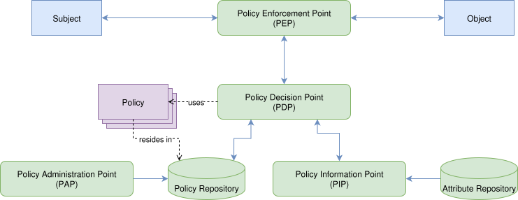

These roles are:

* **Subject:** An active entity (e.g., a user, application, or device) that attempts to perform an action on an Object.
* **Object:** A passive entity (e.g., a file, an insurance record, or a blog article), that is the target of an action attempted by the Subject. 
* **Policy:** A set of rules that define who is allowed to do what under which conditions — for example, "Managers can approve expenses under $1000", or "Users can access documents they own". Policies are evaluated at runtime using attributes of the user, the resource, and the context (such as time, or location).
* **Policy Enforcement Point (PEP):** The component that intercepts a request and enforces the outcome of an authorization decision, allowing or denying the request.
* **Policy Decision Point (PDP):** Evaluates policies and computes authorization decisions based on the incoming request and available data.
* **Policy Information Point (PIP):** Supplies attribute data or contextual information that the PDP requires to evaluate a policy.
* **Policy Administration Point (PAP):** Allows management of access control policies by providing tools for authoring, testing, and maintaining them.

## A Story to Ground the Concepts

Imagine Alice wants to read an article on her favorite blog platform. In this story:

* Alice is the subject.
* The article she wants to read is the object.
* The action ("read") is what she wants to perform.
* Her browser sends a request on her behalf to the platform’s backend services.

Let’s break down what happens step by step:

Each time Alice interacts with the platform — by clicking a link, submitting a form, or opening a page — a request is made to one or more backend services. These services must decide: *Can Alice do this?* and more subtly: *What exactly is Alice allowed to do in this context?*

That decision process starts with the **Policy Enforcement Point (PEP)**. Think of the PEP as a gatekeeper — it sees the request and knows it must enforce some kind of access control. But it doesn't contain the logic to decide **what’s allowed**. Instead, it delegates that to the **Policy Decision Point (PDP)**.

The PDP evaluates the request against a set of policies. These policies might include conditions like:

* Alice must be logged in.
* Alice must have an active subscription.
* Alice can only read the full article if her subscription level is "Premium".

To perform this evaluation, the PDP often needs more information than what’s in Alice’s request. This is where the **Policy Information Point (PIP)** comes in. In this case, one PIP is involved: a user management service that provides Alice’s subscription information. This PIP supplies the PDP with the information needed to evaluate the aforesaid policies.

But here’s where a crucial detail often gets missed: the PDP doesn't always answer a **closed question** like "yes" or "no". In many cases, the PDP may answer **open questions** with answers like:

* Alice can read the article, but only the excerpt.
* Alice can read the full article if her subscription is "Premium" or if the article is marked as public.
* Alice can read up to three full articles per day on a free plan.
* Alice can read that particular set of articles

In these cases, the PDP returns a decision along with additional access context information that describes *how* access is permitted, and which additional actions to perform. This might include details like which parts of a resource are visible or what usage limits apply. For example, if Alice is on a free plan and has already read three full articles today, the PDP might return a "permit" decision along with structured attributes specifying that only the excerpt of the requested article should be shown.

The PEP then takes that decision and enforces it, meaning the request is either allowed to proceed to the protected resource or is blocked. Enforcement is binary: permit or deny. But if the decision includes additional data — like an instruction to show only the excerpt — it’s up to downstream components to interpret and act on that. In Alice’s case, this means shaping the response to include only the article excerpt.

There is, however, one essential prerequisite: the system must know who the subject is — that is, it must verify the subject’s identity, confirming that Alice is indeed Alice. This verification process is the domain of authentication. Without it, the PEP has no basis on which to enforce access decisions. Authentication is therefore foundational, which is why we begin by examining authentication patterns and approaches. But before doing that, there is a need to explore a few essential concepts that provide context for understanding the broader landscape of authentication and authorization.

## Policy Representations and Lifecycle

As described above, authorization policies define who can do what under which conditions. Depending on how they're represented and integrated into a system, their impact on development, operations, and security can vary widely. In practice, policies are implemented in two main ways:

* **Hardcoded policies:** These are embedded directly in application code — for example, conditional checks like `if user.role == 'admin'`. In this model, the PDP is implicit within the application logic, and the PEP might be an interceptor, handler, or a simple conditional branch.
* **Declarative policies:** These are defined outside the application code in structured formats, evaluated by a dedicated PDP. Examples include policies written in [Rego](https://www.openpolicyagent.org/docs/policy-language), [Cedar](https://www.cedarpolicy.com/en), [XACML](https://www.oasis-open.org/committees/tc_home.php?wg_abbrev=xacml), or other authorization languages. This model clearly separates the enforcement logic (PEP) from decision logic (PDP) and externalizes policy definition.

Declarative policies allow the policy lifecycle to be managed independently of the application lifecycle. This separation has several operational and organizational benefits:

* Access policies reflect business rules, regulatory obligations, or security requirements — and while these are also drivers for application features, their rate of change, ownership, and scope typically differ:
  * Regulatory updates may require immediate changes to access conditions without modifying the underlying feature set.
  * Security incident response might require temporary or permanent changes to access controls outside a normal release cycle.
  * Declarative policies empower non-developers to request or implement access changes (e.g., enabling partner access during a pilot program) without waiting for a full development cycle or redeployment, especially when the changes don't require altering core application logic.
  * Policies may vary in scope or depth, with some governing access across multiple services or applications, while others are more narrowly focused.

  When access policies are tightly coupled to code, any change — no matter how urgent or isolated — requires a code change, test cycle, and deployment. Separating policy from application code allows organizations to react faster and more safely to changes, without compromising the integrity of the software development process.

* Policies are high-stakes — access control bugs are different from feature bugs. They tend to be catastrophic, not just annoying:

  * Granting access when you shouldn't can lead to **data breaches**
  * Revoking access incorrectly can **break business** processes

  Externalized policies are easier to review, audit, and test — just like any other configuration artifact. They can also be subject to staged rollouts and automated validation. Enabling and governing these capabilities is the responsibility of the **Policy Administration Point (PAP)**, which orchestrates the authoring, validation, and controlled distribution of policies. Policies themselves are also subject to access controls. In that sense, the PAP also incorporates aspects of the PEP and the PDP — but is focused entirely on the policy lifecycle rather than on business-related decisions.

* Declarative policies also enable *before-the-fact audit* — the ability to answer "Who currently has access to this object/resource?" without needing to wait for a request to happen or instrument code. This reverse-query capability is essential for governance, compliance, and risk assessments, and is practically impossible when policies are hardcoded and scattered across multiple applications.

## First-Party vs. Third-Party

A key distinction in access control scenarios lies in **on whose behalf** the subject is acting. This determines whether we’re dealing with a **first-party** or a **third-party** context.

In a **first-party** scenario, the subject acts on their own behalf — for instance, when Alice reads or edits articles in her account. In a **third-party** scenario, the subject is acting on behalf of someone else — like when Alice delegates access to an external service that analyzes her articles. The third-party service becomes the subject, while Alice remains the principal authorizing access.

This distinction has important implications for how delegation is modeled, how trust is established, and what guarantees are needed from the involved systems.

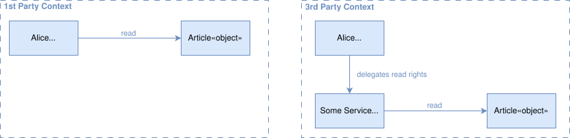

Between these scenarios, there is also a special case within the first-party context, where a user explicitly authorizes a trusted internal service to act on their behalf. In this situation, the user acts both as the subject (requesting the action) and as the PDP by giving explicit consent. This typically occurs within trusted domains, where user approval initiates actions executed by internal services. For example, in a banking app, the user approves a transaction, while the banking system acts as the PEP. These interactions rely on existing authentication and authorization mechanisms and are enhanced by dedicated protocols to ensure integrity and non-repudiation. Additionally, other PDPs within the system may apply further controls, such as fraud detection, compliance verification, or transaction limits, before final enforcement.

While exploring these contexts, it's important to understand that different protocols address different needs. Some protocols are tailored to the first-party context only, such as [Security Assertion Markup Language (SAML)](https://www.oasis-open.org/standard/saml/) or [Central Authentication Service (CAS)](https://apereo.github.io/cas/7.2.x/index.html), which are primarily designed for direct user authentication and carry attributes for authorization purposes within trusted domains. Others, like [Open Authorization (OAuth 2.0)](https://datatracker.ietf.org/doc/html/rfc6749), focus exclusively on the third-party context, enabling delegated access to resources on behalf of another party. And then there are protocols like [OpenID Connect (OIDC)](https://openid.net/specs/openid-connect-core-1_0.html) that support both contexts, combining identity information with delegated access.

What all these protocols have in common is that they define mechanisms to authenticate the involved parties. However, the details of how this authentication is performed - e.g., through passwords, or by making use of other factors - are not covered in this cheat sheet. Likewise, the protocols themselves are not the focus here; there are excellent existing cheat sheets for that purpose (which we will reference). Instead, this document emphasizes patterns: how different approaches to authentication and authorization are architecturally applied, and what implications they carry.

## On Subjects, Principals and Identities

Another important topic to understand before we explore authentication and authorization patterns is the concept of a **subject**. According to the reference architecture and the story above, a subject is an active entity that carries an identity and is the target of authentication.

However, in most real-world systems, authentication is not limited to a single type of active entity. Instead, there are often multiple forms of identity involved, each representing a different kind of actor or context:

* **End-users:** Human users interacting with a system via e.g. a browser, or a mobile app.
* **Devices:** The user’s device (e.g., smartphone, laptop, or IoT hardware), which may have its own identity.
* **External clients:** Applications or scripts accessing an API on behalf of a user or system.
* **Internal workloads:** Services or components within a distributed system communicating with each other.

All of these are **principals** — identifiable entities that can be authenticated and authorized. A **subject**, in turn, may consist of one or more such principals. For example, a request from a mobile app may involve both the authenticated user and the device they’re using. In a service-to-service call, the subject might be the internal service identity, optionally carrying along delegated user context.

Importantly, the definition of a subject is often shaped by the perspective of the PDP that evaluates the request. Each PDP — or even each policy — may view the subject differently, based on what attributes or entities are relevant for its decision-making. One policy may only care about the identity of the user. Another may treat the combination of user and device as the subject. A third may include the client application or network context as additional principals. In this sense, a subject is not a fixed notion, but a context-dependent composition of principals as seen by the evaluating component.

Understanding subjects in this compositional and context-sensitive way is key to interpreting the patterns described in this cheat sheet. While many patterns focus on a single principal type (e.g., user or service), they often support **multi-principal subjects** through identity propagation and proper orchestration of authentication mechanisms.

The last remaining concept to cover is **identity**. An identity is a collection of attributes that uniquely identify an entity, similar to a primary key in a database. In some cases, this might be a single attribute such as an ID, while in others it can be a combination of several attributes. Unlike subjects and principals, which refer to active entities or actors, the concept of identity also applies to passive entities — the objects — as well.

## Authentication Patterns

Authentication can be handled at different layers of a system’s architecture. Broadly speaking, there are three main approaches: 

* **Service-Level:** responsibility for verifying identity is delegated to each service, or to a proxy tightly coupled to it.
* **Edge-Level:** authentication is centralized in a shared component at the system boundary.
* **Kernel-Level:** authentication is performed in the operating system kernel, using cryptographic identities enforced at the transport layer.

Each approach comes with trade-offs in terms of scalability, consistency, and operational complexity.

Authentication applies to different types of actors. These can be **external** actors, such as end users or client applications outside the system, or **internal** actors, such as services, or other workloads, and even nodes, the workloads are running on, all operating within the system boundary. The same architectural patterns can often be applied to both kinds of actors, though the technical mechanisms and trust assumptions differ.

Before diving into these patterns, it is also important to clarify what is being verified. Most systems handle authentication in two phases:

* **Primary Authentication:** This is the process of directly verifying credentials tied to authentication factors, such as passwords, biometric inputs, or signed challenges like WebAuthn assertions. For internal actors, this might involve validating machine-issued certificates, SPIFFE IDs, or workload authentication data issued by the platform. This step establishes identity by proving control over a credential and linking it to a known identity, such as a user account or a system identity.
* **Authentication Proof Verification:** After successful primary authentication, the system typically issues an authentication proof — a reusable artifact that confirms the authenticated identity in subsequent interactions. At the application layer, this might take the form of a session cookie, token, or assertion. At lower layers, it can take the form of cryptographic session state, such as a TLS session key, IPsec Security Association, or similar. Verifying the proof ensures that the identity remains trusted without repeating primary authentication.

Where this distinction is not relevant, the term **authentication data** is used to refer collectively to both primary credentials and authentication proofs. The following subsections use this term when referring to either or both phases.

The patterns described below differ in **what** is verified (credentials in primary authentication vs. authentication proofs), **where** verification happens, and **which** implications this has for system design and trust boundaries.

### Service-Level Embedded Authentication

In this pattern, each service is responsible for handling primary authentication internally. This includes managing identities and credentials, performing credential verification, and implementing authentication workflows. Common credential types used in this setup include username/password, API keys, and similar simple methods. All authentication logic and subject related data storage are embedded directly within the service, often through custom code or built-in libraries.

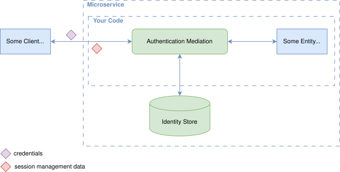

#### Pros

* **Simplicity:** Each service is fully self-contained and does not rely on external systems or additional infrastructure for authentication.
* **Customization freedom:** Authentication behavior can be adapted to service-specific requirements without external constraints.
* **Support for external and internal actors:** Since the implementation of a service can fully control all authentication related functionality, orchestration of different authentication contexts - like authentication of internal services and external users - is possible, but comes with a huge complexity (see also the authentication orchestration con below).

#### Cons

* **Inconsistency:** Authentication behavior, credential storage, and authentication flows differ across services, leading to fragmentation and a poor user experience, incl. not being able to support SSO.
* **Security risk:** Authentication code is duplicated across services, increasing the risk of vulnerabilities and complicating audits.
* **Maintenance burden:** Changing authentication methods (e.g., introducing MFA) requires updates across all affected services.
* **Limited scalability:** Each service is responsible for identity management, complicating secure identity management across a large system. This makes the pattern unsuitable for scalable service-to-service authentication.
* **Limited observability and governance:** Suspicious activity often goes undetected without centralized monitoring. Credential reuse, account compromise, or brute-force attacks on one service remain invisible to others, hindering coordinated detection and response.
* **Authentication orchestration:** Handling of multi-principal subjects — that is supporting multiple authentication configurations, including protocol chaining and subject-specific variations, required to support different contexts, like first- and third-party, or external client and service-to-service authentication — adds significant complexity.
* **Coupling of external authentication data with internal trust assumptions:** Using the same authentication data for both external clients and internal services increases the risk of leakage and unauthorized access. If an internal service is inadvertently exposed because of a misconfiguration or an attacker gaining internal access, the leaked authentication data may enable unauthorized access to sensitive resources.

### Service-Level Code-Mediated Authentication

This pattern addresses key limitations of the [Service-Level Embedded Authentication](#service-level-embedded-authentication), such as fragmented identity management, duplicated credential stores, and lack of support for SSO. In this pattern, the service no longer verifies credentials directly. Instead, an external Identity Provider (IdP) authenticates the subject and issues authentication proofs. The service verifies these internally and extracts identity attributes for request processing.

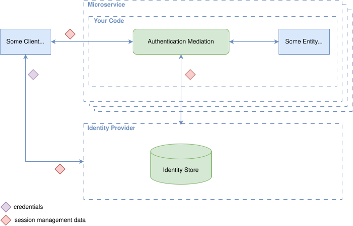

#### Pros

* **SSO support:** Identity and credential lifecycle is consolidated in the IdP, enabling Single Sign-On and reducing duplication.
* **Lower security risks:** Centralized authentication reduces the attack surface related to credential handling.
* **Improved user experience:** Consistent authentication flows and session handling across services.
* **Interoperability:** Widely adopted protocols like [OIDC](https://openid.net/specs/openid-connect-core-1_0.html) and [SAML](https://www.oasis-open.org/standard/saml/) provide flexibility and broad integration possibilities with various IdPs.
* **Customization freedom:** Services can still tailor authentication behavior to specific needs, for example, in environments where standards like OIDC are not applicable.
* **Support for external and internal actors:** Since the implementation of a service can fully control all authentication related functionality, orchestration of different authentication contexts - like authentication of internal services and external users - is possible, but comes with a huge complexity (see also the authentication orchestration con below).

#### Cons

* **Protocol handling overhead:** Each service must implement and maintain logic for authentication proof verification and protocol-specific behavior.
* **Misconfiguration risks:** Incorrect verification logic, such as missing expiration checks or improper cryptography use, can introduce sever security vulnerabilities.
* **Authentication orchestration:** Handling of multi-principal subjects — that is supporting multiple authentication configurations, including protocol chaining and subject-specific variations, required to support different contexts, like first- and third-party, or external client and service-to-service authentication, adds significant complexity.
* **Coupling of external authentication data with internal trust assumptions:** Using the same authentication data for both external clients and internal services increases the risk of leakage and unauthorized access. If an internal service is inadvertently exposed because of a misconfiguration or an attacker gaining internal access, the leaked authentication data may enable unauthorized access to sensitive resources.

### Service-Level Proxy-Mediated Authentication

This pattern builds on the [previous pattern](#service-level-code-mediated-authentication) but further reduces complexity within services by offloading authentication-related logic to a dedicated proxy deployed as a sidecar alongside the service. The proxy operates in front of the application, forwards requests locally to it, performs verification of authentication proofs with the Identity Provider (IdP), and injects identity context, typically via headers, into requests before forwarding them to the service.

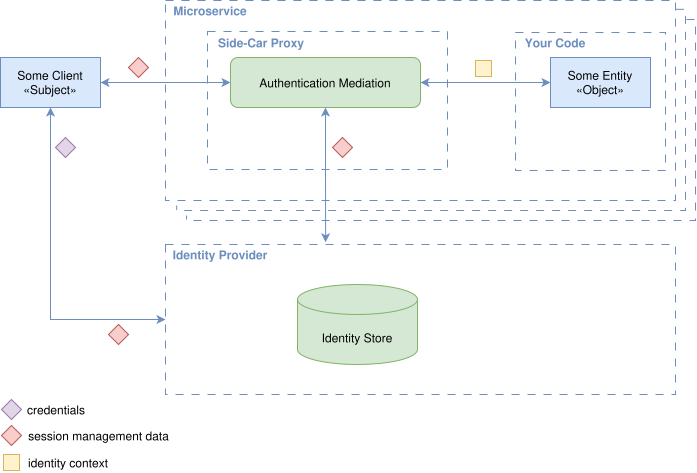

#### Pros

* **SSO support:** Identity and credential lifecycle is consolidated in the IdP, enabling Single Sign-On and reducing duplication.
* **Lower security risks:** Centralized authentication reduces the attack surface related to credential handling.
* **Improved user experience:** Consistent authentication flows and session handling across services.
* **Interoperability:** Widely adopted protocols like [OIDC](https://openid.net/specs/openid-connect-core-1_0.html) and [SAML](https://www.oasis-open.org/standard/saml/) provide flexibility and broad integration possibilities with various IdPs.
* **Separation of concerns:** Removes authentication-related logic from application code by offloading it to the proxy, simplifying service development and reducing maintenance effort.
* **Consistent behavior:** Identity verification and protocol handling in the proxy ensure uniform behavior across services.
* **Improved security posture:** Reduces the risk of implementation flaws by consolidating authentication-related logic into a dedicated, hardened component.
* **Authentication orchestration:** Some proxies support multiple authentication configurations, including protocol chaining and subject-specific variations. This enables support for different contexts, such as first- and third-party access, or a mix of external clients and internal services.
* **Strong foundation for service-to-service trust:** Enables [Zero Trust](https://csrc.nist.gov/pubs/sp/800/207/final) networking with workload identity, typically realized via systems like [SPIFFE/SPIRE](https://spiffe.io/), which define workload identities embedded in [X.509 certificates](https://www.rfc-editor.org/rfc/rfc5280) used for [mTLS](https://www.rfc-editor.org/rfc/rfc8446) authentication between services.

#### Cons

* **Operational complexity:** Requires deployment and maintenance of additional components per microservice, leading to higher resource usage and costs.
* **Header spoofing risk:** Misconfiguration or insufficient validation in the proxy can allow malicious clients or internal actors to spoof or manipulate identity headers. Ensuring correct proxy setup and strict header validation is essential to maintain the integrity of identity information.
* **Configuration consistency:** All proxies across the service landscape must be configured uniformly to ensure consistent authentication behavior and user experience. Inconsistencies in configuration can lead to confusing user flows or even security vulnerabilities.
* **Coupling of external authentication data with internal trust assumptions:** Using the same authentication data for both external clients and internal services increases the risk of leakage and unauthorized access. If an internal service is inadvertently exposed because of a misconfiguration or an attacker gaining internal access, the leaked authentication data may enable unauthorized access to sensitive resources.

### Edge-Level Authentication

In this pattern, authentication is handled at the system boundary by a shared component such as an API gateway or ingress proxy. This component authenticates incoming requests from external clients before they reach internal services. It integrates with one or multiple Identity Providers (IdPs) using protocols such as [OIDC](https://openid.net/specs/openid-connect-core-1_0.html), [OAuth2](https://www.rfc-editor.org/rfc/rfc6749), [SAML](https://www.oasis-open.org/standard/saml/), [mTLS](https://www.rfc-editor.org/rfc/rfc8446), or other mechanisms, and propagates verified identity information, typically via headers, to downstream services for further processing.

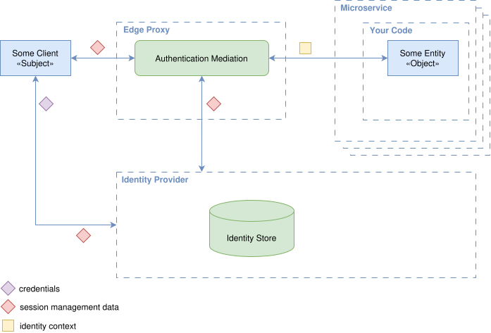

This approach consolidates authentication logic into a single enforcement point, simplifies service implementation by removing per-service authentication handling, and is particularly common in [Zero Trust](https://csrc.nist.gov/pubs/sp/800/207/final) architectures.

#### Pros

* **Improved consistency:** Authentication is performed uniformly and consistently across services at a single entry point, reducing fragmentation, configuration drift, and improving auditability.
* **Simplified service logic:** Internal services are relieved from implementing authentication logic, focusing only on authorization and business functionality.
* **Faster service onboarding:** New services can rely on existing infrastructure for authentication, requiring minimal additional setup.
* **Protocol-agnostic identity propagation:** Verified identity information can be propagated to internal services using trusted, implementation-independent formats (e.g., via a newly issued [JWT](https://www.rfc-editor.org/rfc/rfc7519), injected headers carrying identity information in protected form using standards like [HTTP Message Signatures](https://www.rfc-editor.org/rfc/rfc9421.html)), or signed proprietary structures. This avoids passing raw external authentication data, as is necessary with all previous patterns.

#### Cons

* **Limited granularity:** Fine-grained or per-endpoint authentication policies (e.g., step-up authentication) are generally harder to implement and may require additional coordination with downstream services. This heavily depends on the capabilities of the edge proxy
* **Identity propagation challenges:** Ensuring secure and reliable propagation of identity context (e.g., via headers) requires strict validation and trust models between the edge and internal services. Proper governance can help overcome this limitation.
* **Single Point of Failure:** While the ingress proxy or gateway is already a central component in most architectures, performing authentication at the edge makes it a critical part of the security infrastructure. Misconfiguration or compromise can impact not just access, but the integrity of authentication decisions system-wide.
* **Not suitable for service-to-service authentication:** Edge-level authentication only applies to incoming external requests. Internal service-to-service calls require additional authentication mechanisms. Although technically possible, routing internal communication through the edge may introduce severe performance bottlenecks.

### Kernel-Level Authentication

This pattern involves performing authentication at the operating system kernel level using cryptographic identities attached to either a service, or a machine/node, the service is running on. The actual implementation is based on protocols, such as [IPSec](https://www.rfc-editor.org/rfc/rfc6071), or [WireGuard](https://www.wireguard.com/). The identity of a peer is cryptographically verified on each exchanged packet and is limited to [layer 3](https://en.wikipedia.org/wiki/Network_layer). This form of enforcement is transparent to applications, making it a strong foundation for secure communication between workloads.

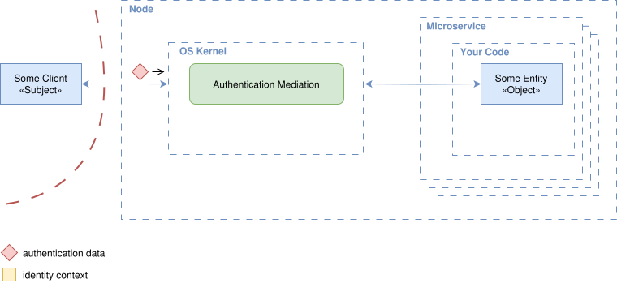

#### Pros

* **Transparent to applications:** Services do not need to implement authentication logic; identity is enforced by the OS Kernel.
* **Protocol-agnostic:** Applies to all traffic types, not just HTTP.
* **Low latency:** Enables fast connection setup with strong isolation guarantees.
* **Provides strong workload identity:** Provides identity verification tied directly to the transport channel, reducing risk of spoofing or replay, which makes it a strong foundation for service-to-service trust and enables [Zero Trust](https://csrc.nist.gov/pubs/sp/800/207/final) networking models.

#### Cons

* **Not suitable for layer 7 — application-level — authentication:** Identities are tied to workloads or nodes only and not to individual users or external clients. Because of this, this pattern cannot convey user-specific identity attributes.
* **Limited observability:** Monitoring is confined to connection-level data (e.g., source/target workloads), lacking insight into user-driven actions within the application.
* **Infrastructure complexity:** Requires robust automation for identity management, and OS- or kernel-level authentication policy enforcement mechanisms (e.g. via [eBPF](https://ebpf.io/)).

### Operational and Security Considerations

While the above authentication patterns differ primarily in terms of *where* and *how* authentication is performed, they also have significant implications for operations and authorization. Choosing the right pattern often comes down to balancing development flexibility, operational effort, and risk tolerance.

#### Operational Considerations

| Pattern                          | Configuration & Implementation Burden | Operational Overhead     | Observability Scope        |
| -------------------------------- |---------------------------------------| -----------------------  |----------------------------|
| **Service-Level Embedded**       | High                                  | High                     | Application-specific       |
| **Service-Level Code-Mediated**  | Medium                                | Medium                   | IDP + Application-specific |
| **Service-Level Proxy-Mediated** | Medium                                | High (infra cost)        | Proxy + Application        |
| **Edge-Level**                   | Low                                   | Low                      | Centralized (Proxy)        |
| **Kernel-Level**                 | Low-Medium                            | High (infra complexity)  | Network-level only         |

Patterns with decentralized authentication (like [Service-Level Embedded Authentication](#service-level-embedded-authentication)) typically incur more operational overhead due to inconsistencies, duplicated configuration, and monitoring complexity. Centralized patterns reduce duplication but introduce infrastructure dependencies and require resilient design.

#### Security Considerations

Security risks increase significantly when authentication logic and credentials are handled directly within application code. Centralized enforcement approaches — whether at the IDP, edge, or within the OS kernel — help limit exposure, enforce stronger boundaries, and reduce the risk of misconfiguration (especially at the edge). However, care must be taken to prevent trust leakage, which directly impacts the ability to enforce the principle of least privilege. Achieving this depends not only on where authentication occurs, but also on how identity information is propagated and verified downstream. Without trustworthy, tamper-resistant propagation, even strong initial authentication can be undermined — weakening trust boundaries and ultimately impairing the system’s ability to make reliable authorization decisions. To address this, the next section examines common identity propagation strategies and their impact on system security, observability, and trust enforcement.

**Note:** Operational and security concerns such as token theft, replay protection, session lifecycle, and reauthentication are critical when implementing authentication mechanisms. These topics are extensively covered in e.g. [OWASP Authentication Cheat Sheet](https://cheatsheetseries.owasp.org/cheatsheets/Authentication_Cheat_Sheet.html), and [Session Management Cheat Sheet](https://cheatsheetseries.owasp.org/cheatsheets/Session_Management_Cheat_Sheet.html).

## Identity Propagation Patterns

As mentioned in the previous section, trustworthy identity propagation — the focus of this section — is essential for maintaining strong trust boundaries across a system. Architectures following [Zero Trust](https://csrc.nist.gov/pubs/sp/800/207/final) principles exemplify this need, as they emphasize strict access control and continuous verification. This section introduces commonly used identity propagation patterns — that is, the ways in which identity context flows between services. These patterns influence where and how access control decisions are made, the reliability and trustworthiness of those decisions, and ultimately how effectively least privilege can be enforced. They also differ in how tightly internal services are coupled to the external authentication mechanisms and identity representations used at the boundary.

Some identity propagation patterns aim to decouple internal service logic from specific external authentication protocols and data formats. This approach, often called *protocol-agnostic* or *token-agnostic* identity propagation, means internal services consume a normalized, unified identity representation that abstracts away the details of the original authentication protocol and authentication data (including both primary credentials and authentication proofs). This abstraction enables internal services to remain stable, simplified, and focused on authorization logic, even as external authentication methods evolve or change.

At one end of the spectrum, some patterns directly forward externally issued authentication data (such as OAuth2 tokens, session cookies, or certificates) downstream, requiring internal services to understand and process the original authentication protocols. This approach can increase complexity and trust assumptions within internal services. At the other end, a trusted system component at the edge transforms incoming authentication data into cryptographically signed, normalized identity structures. These structures abstract away the original protocol and data format, allowing internal services to remain agnostic to how authentication was performed. By providing tamper-resistant, verifiable representations of identity, they establish strong trust boundaries across service interactions and enable auditable access decisions, making them especially effective for enforcing least privilege in distributed environments.

Between these extremes exist intermediate patterns where internal services rely on simplified identity representations issued or transformed by upstream services but without cryptographic protections, requiring implicit trust between services.

Each pattern involves trade-offs between implementation complexity, security, trust, privacy and operational overhead. Choosing the appropriate identity propagation approach depends on the system’s security posture, scalability requirements, and the desired level of trust between internal components.

Understanding these trade-offs in concrete terms requires examining how identity propagation is commonly implemented in practice. The following sections describe representative patterns along this spectrum, highlighting their characteristics, benefits, and limitations.

### External Identity Propagation

In this pattern, the edge component forwards the externally received authentication data (e.g., an access token, ID token, session cookie, or certificate) directly to internal services without transformation. The internal services are responsible for the verification of the received authentication data, for extracting the identity context (such as user ID, or other attributes), and making access control decisions based on it. When an internal service needs to communicate with another service, it just forwards the authentication data further downstream. The aforesaid verification may require contacting a Verifier, which depending on the authentication protocol and data used, could be an authorization server that issued the token or, for example, an OCSP responder to check the revocation status of a certificate.

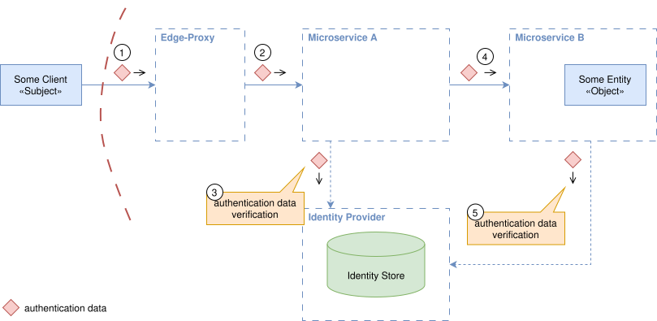

As already said above, the actual verification of the authentication data, represented by the dotted lines in steps 3 and 5 of the diagram above, depends on the type of authentication data used. For example, in the case of an opaque token, each service must call the appropriate identity provider, respectively, authorization server endpoint to retrieve the associated data. If the token is self-descriptive, such as a [JWT](https://www.rfc-editor.org/rfc/rfc7519), the service needs the corresponding key material to verify its signature, and so on.

#### Pros

* **Minimal edge logic required:** The edge mainly forwards the authentication data, reducing its complexity. It may also just verify the validity of the authentication data.
* **No additional infrastructure needed:** Internal services use the same authentication data as the edge, avoiding the need for internal signing or identity transformation.

#### Cons

* **Tight coupling to external protocols:** Each microservice must understand and correctly handle potentially multiple types of external authentication data and formats (e.g., [OAuth2](https://www.rfc-editor.org/rfc/rfc6749), [OIDC](https://openid.net/specs/openid-connect-core-1_0.html), cookies). As a result, services must support protocol-specific logic (e.g., [JWT](https://www.rfc-editor.org/rfc/rfc7519) parsing, OAuth2 token validation, cookie decoding) and are exposed to external semantics, expiration rules, and revocation mechanisms, increasing implementation complexity and brittleness. Changes to external identity providers or protocols typically break internal service behavior.
* **Increased security risk:** If external authentication data is leaked, any internal service exposed, intentionally or not, can potentially be accessed directly using the leaked token.
* **Unsuitable for [Zero Trust](https://csrc.nist.gov/pubs/sp/800/207/final) or multi-tenant environments:** Trust assumptions and lack of verifiability conflict with the security guarantees required in these environments.
* **Privacy concern:** Because externally visible authentication data is reused internally, identifiers intended for internal use (e.g., subject IDs in JWTs) may become externally observable. This can violate privacy requirements by enabling cross-context linkability and may conflict with regulations such as the GDPR or the CCPA.

### Simple Service-Level Identity Forwarding

This pattern builds on the previous one but introduces a lightweight form of internal identity abstraction. While the edge component still forwards the externally received authentication data (e.g., an access token, ID token, session cookie, or certificate) to internal services, each microservice no longer forwards this data unchanged. Instead, a microservice extracts the relevant identity information (e.g., user ID, roles, scopes) from the incoming request and creates a simplified representation of the identity, such as a plain JSON object, a self-signed JWT, or even a single value embedded in a query or path parameter, when making calls to downstream services. As with the previous pattern, the verification of the initially received authentication data may require contacting a Verifier, which depending on the authentication protocol and data used, could be an authorization server that issued the token or, for example, an OCSP responder to check the revocation status of a certificate.

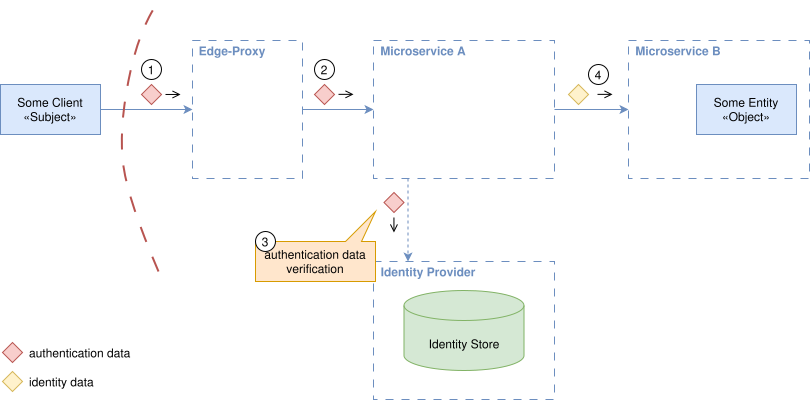

This internal identity representation is not strongly cryptographically protected and often relies on implicit trust between services. As a result, downstream services must trust the integrity and correctness of the identity information forwarded by their upstream callers.

As with the previous pattern and as also said above, the actual verification of the received authentication data, represented by the dotted line in steps 3 of the diagram above, depends on the type of authentication data used. For example, in the case of an opaque token, the service must call the appropriate identity provider, respectively, authorization server endpoint to retrieve the associated data. If the token is self-descriptive, such as a JWT, the service needs the corresponding key material to verify its signature, and so on.

#### Pros

* **Simple and lightweight:** Requires minimal implementation effort and no complex cryptography or signing infrastructure.
* **Protocol abstraction:** Internal services operate on simplified identity representations, avoiding the need to parse or validate external authentication protocols.
* **Flexible identity forwarding:** Enables propagation of identity context without dependency on a central trusted issuer for every internal call.

#### Cons

* **High trust requirement:** Downstream services must trust upstream callers to provide unaltered and accurate identity information and related data.
* **Vulnerable to spoofing:** Lack of cryptographic protection makes identity data susceptible to tampering.
* **Unsuitable for [Zero Trust](https://csrc.nist.gov/pubs/sp/800/207/final) or multi-tenant environments:** Trust assumptions and lack of verifiability conflict with the security guarantees required in these environments.
* **Protocol complexity leakage:** If any internal service becomes externally exposed, support for full external authentication mechanisms is required to avoid API abuse.
* **Privacy concern:** Because externally visible authentication data is reused internally, identifiers intended for internal use (e.g., subject IDs in JWTs) may become externally observable. This can violate privacy requirements by enabling cross-context linkability and may conflict with regulations such as the GDPR or the CCPA.

### Token Exchange-Based Identity Propagation

This pattern builds upon the previous pattern by introducing a trusted intermediary, an authorization server, through use of the [OAuth2 Token Exchange](https://www.rfc-editor.org/rfc/rfc8693), or the new [OAuth2 Transaction Tokens (draft)](https://datatracker.ietf.org/doc/html/draft-ietf-oauth-transaction-tokens) protocol. A microservice that receives a request containing externally issued identity (e.g., an access token) exchanges it for a new, signed access token issued by the authorization server. This exchanged token is specifically scoped for a downstream internal service and is then propagated as part of the internal call. As with the previous patterns, the verification happens optionally with the help of a Verifier. The issuance of a new token is, however, the responsibility of the Secure Token Service (STS). The latter assumes the role of the Verifier for the verification of tokens it has issued. Both might be implemented by the same authorization server, but don't need to.

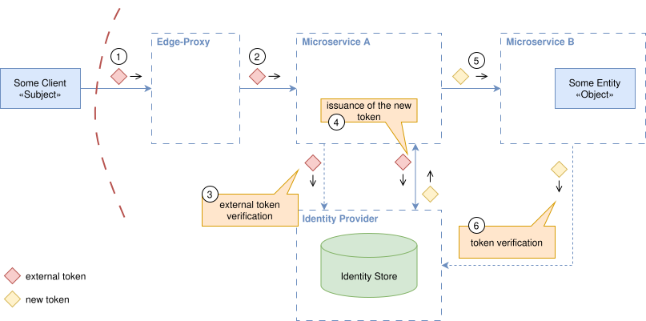

Downstream services trust the token issued by the STS rather than the one used by the external client ("Some Client" in the diagram above). The pattern improves the trust model and strengthens identity guarantees, but is tightly coupled to the [OAuth2](https://www.rfc-editor.org/rfc/rfc6749) protocol family and its associated token types.

The actual verification of all involved tokens, represented by the dotted lines in steps 3 and 6 of the diagram above, depends on the type of the token used. For example, in the case of an opaque token, each service must call the appropriate identity provider endpoint to retrieve the associated data. If the token is self-descriptive, such as a JWT, the service needs the corresponding key material to verify its signature.

#### Pros

* **Improved trust model:** Downstream services do not need to trust upstream service implementations, only the STS.
* **Cryptographically verifiable identity:** Issued tokens are signed by an STS, offering strong integrity guarantees.
* **Scoping and audience control:** Exchanged tokens can be restricted in scope and audience, reducing the risk of token misuse.

#### Cons

* **OAuth2-specific:** Relies on [OAuth2 Token Exchange](https://www.rfc-editor.org/rfc/rfc8693), respectively, on [OAuth2 Transaction Tokens (draft)](https://datatracker.ietf.org/doc/html/draft-ietf-oauth-transaction-tokens), limiting its applicability to systems using that protocol family for externally visible authentication data.
* **Service-side complexity:** Application code must integrate with the STS to handle token exchange logic, and manage caching or retries.
* **Latency overhead:** The token exchange process introduces additional network round-trips per request flow unless aggressively optimized.
* **Operational dependency on the STS:** Introduces runtime dependency on the STS implementation availability and scalability.

### Protocol-Agnostic Identity Propagation

The external request is authenticated at the system edge by a trusted component, which then generates a cryptographically signed (and/or encrypted) data structure representing the external entity’s identities and attributes (e.g., user ID, roles, permissions) - typically a self-contained, verifiable structure, such as a JWT or a proprietary signed format. By doing that, the edge component assumes the role of a Secure Token Service (STS) This signed identity structure, hereafter referred to as a token, is propagated downstream to internal microservices. Internal services trust the signature from the edge issuer and use the token to make access control decisions.

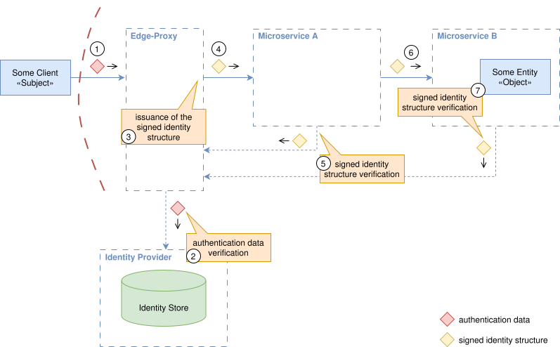

As with the previous pattern, the verification of the original authentication data may require contacting a Verifier. The implementation of the Verifier depends on the protocol and data format used — e.g. it could be an authorization server that issued a token, or it could be an OCSP responder, used to check the revocation status of a certificate. Unlike in previous patterns, only the edge component is responsible for that verification. The specific verification process depends on the aforesaid type and format of the authentication data, denoted by the dotted line in step 2. 

Further downstream, the microservices validate the signed token issued by the trusted edge-component. Each microservice must have access to the corresponding verification key to validate the authenticity of this token. The corresponding verification steps are denoted by the dotted lines in steps 5 and 7. This is where the trusted component at the edge assumes the role of a Verifier.

It’s worth noting that the edge-component roles shown in the diagram above — Edge Proxy, STS, and Verifier — may all be implemented within a single technical component, or split across multiple cooperating services. For example, a proxy might delegate the authentication data and token issuance related logic to another service via a mechanism typically named as *forward auth* or *external auth*. That service could implement the STS and the Verifier logic by itself, or, in turn, delegate token issuance to an existing authorization server using mechanisms such as the [OAuth2 Token Exchange](https://www.rfc-editor.org/rfc/rfc8693), as described in the previous pattern.

#### Pros

* **Cryptographic trust:** Signed tokens provide strong guarantees about the integrity and authenticity of the propagated identity.
* **Decoupling from external authentication data and context:** Internal services neither handle external protocols nor need to differentiate whether requests originate from first- or third-party actors, simplifying their logic and trust assumptions.
* **Rich identity context:** Allows inclusion of fine-grained identity and authorization metadata.
* **Secure across trust boundaries:** Suitable for multi-tenant and [Zero Trust](https://csrc.nist.gov/pubs/sp/800/207/final) environments.
* **Separation of external and internal identities:** Enables mapping externally known identifiers to distinct internal representations, preventing direct exposure of internal identifiers and thereby enhancing privacy by reducing correlation and tracking risks across domains.

#### Cons

* **Key management complexity:** Requires secure handling and rotation of signing keys to maintain trust.
* **Token size overhead:** Signed tokens issued by the edge component may be large, increasing network overhead.
* **Revocation challenges:** Once issued, tokens may be valid for many services until expiration, complicating immediate revocation. This can, however, be mitigated by issuing short-lived tokens and tailoring subject structures to individual downstream services.
* **Increased complexity at the edge:** The edge component must handle external authentication data verification as well as internal token generation and signing, making it a critical security component.

### On Privacy By-Design

Privacy concerns — particularly around cross-context linkability and the risk of exposing internal identifiers — affect all identity propagation patterns, though their severity depends on how externally received authentication data is handled.

Implementation of patterns like [External Identity Propagation](#external-identity-propagation) and [Simple Service-Level Identity Forwarding](#simple-service-level-identity-forwarding) typically directly reuse externally visible authentication data within the system. This increases the risk that internal identifiers (e.g., `sub` claims in JWTs) become externally observable, enabling correlation of user activity across contexts. Such reuse undermines core privacy goals like pseudonymisation and data minimisation and conflicts with principles of integrity and confidentiality — all central to privacy-by-design thinking.

In contrast, patterns like [Token Exchange-Based Identity Propagation](#token-exchange-based-identity-propagation) and [Protocol-Agnostic Identity Propagation](#protocol-agnostic-identity-propagation) help enforce privacy boundaries by transforming or isolating authentication data before it’s used internally. That doesn’t mean these patterns — or their specific implementations — are immune to privacy risks. They simply make it easier to adopt techniques such as opaque tokens, session-referencing cookies, or identifier mapping, which reduce unnecessary exposure of user-specific identifiers. Even so, mapped identifiers can still reveal the existence of a persistent relationship with the system, which may be problematic in certain contexts. Still, these patterns embody privacy-by-design principles more effectively — and as a positive side effect, tend to align well with legal requirements such as the GDPR (Art. 5(1)(b, c, f), Art. 32, Recitals 26 and 30), CCPA, and similar frameworks.

## Authorization Patterns

While some basic access control can be applied to anonymous or unauthenticated subjects, the most meaningful authorization requires a reliable understanding of the subject’s identities and associated attributes. Having covered these foundational topics in previous sections, we now turn to how access control decisions are made and enforced across services in distributed systems.

The corresponding architectural approaches can be described by authorization patterns. These patterns define where Policy Decision Points (PDPs), Policy Enforcement Points (PEPs), and Policy Information Points (PIPs) are placed within a system and how they interact. They also govern how subject and object identities, along with related attributes, flow between these components — and where policies are stored and accessed.

Choosing the right patterns is critical, as it directly impacts the system’s security posture, performance, scalability, and maintainability. The following subsections explore the most common ones used in distributed architectures and outline their trade-offs.

### Decentralized Service-Level Authorization

In this pattern, most of the functional components from the reference architecture are implemented directly within each microservice. Even the Policy Information Points (PIPs) may be embedded into the service logic (e.g., via database or configuration entries) if the microservice is responsible for all relevant attributes itself. However, this is rarely the case, and most microservices must integrate with other services to retrieve required attributes, treating those other services as external PIPs.

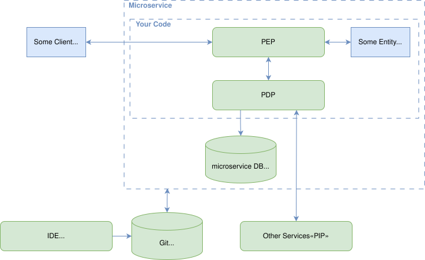

The access control rules are typically implemented using native language constructs (e.g., `if`/`else` statements), either inline with business logic functions or via abstraction mechanisms such as interceptors.

When a microservice receives a request containing authorization data (e.g., end-user context or resource identifiers), it evaluates whether access should be granted. This may involve querying other services (PIPs) for additional attributes before reaching a decision and enforcing it (implicitly). Alternatively, some services may use asynchronous communication patterns (e.g., periodic syncs or event-driven updates) to pre-fetch required data in advance, improving performance and resilience.

When adopting this approach, the following trade-offs should be considered:

#### Pros

* **Familiar development model**: Developers can use the same language and tools they already know.
* **Framework support**: Many libraries and frameworks exist for many languages to reduce boilerplate and simplify integration.
* **Rapid prototyping**: Policy logic is implemented directly in code, enabling quick experimentation and iteration.
* **Team autonomy**: Fits well with independent team ownership; each team can choose its approach.
* **High performance**: Policy evaluation is done in-memory within the microservice.
* **Full context awareness**: The service has access to runtime data, business logic, and domain models, enabling fine-grained, context-rich and nuanced decisions.
* **Failure isolation**: If all required attributes are available locally or cached, failures in external systems do not impact decision-making.

#### Cons

* **Scattered logic**: Authorization requirements tend to spread across multiple services, leading to code duplication, increased complexity, and maintenance overhead. Over time, this results in a slow and error-prone policy lifecycle, significantly reducing time to market. This is a classic "Hardcoded Rules" antipattern.
* **Role explosion**: Business stakeholders typically describe authorization requirements using roles — for example, "a user with role X can do Y". Without introducing an abstraction layer between business roles and the actual implementation, systems often accumulate many similar but inconsistent roles. Roles also tend to evolve or change names over time. This leads quickly to role explosion, again slowing the policy lifecycle and increasing the risk of errors. This is known as the “Code Against the Role” antipattern.
* **Deprived Governance**: Autonomous teams may interpret and implement policies differently, making consistent governance for the whole environment nearly impossible. This may result in enforcement gaps and unpredictable behavior.
* **No central auditability**: When authorization logic is distributed across services, it becomes nearly impossible to answer "before-the-fact" questions such as "Who has access to what, and when?" — a key requirement in compliance and security contexts.
* **Inconsistent monitoring**: Logging and audit trails vary widely across services and are often incomplete or incompatible. This hampers the ability to detect abuse, investigate incidents, or analyze system-wide access patterns.
* **Coverage gaps**: Many frameworks do not expose ways to integrate access control into certain auto-exposed endpoints. Teams may also forget to secure these paths entirely. Documentation of the frameworks is also often inconsistent or misleading. All of that leads to unintended public exposure of sensitive endpoints.

These cons often result in "accept by default" behavior, ultimately leading to broken access control vulnerabilities.

### Centralized Service-Level Authorization

This pattern aims to address the first three drawbacks of the previous pattern — to reduce complexity, improve time to market, and establish governance over policy definitions — by decoupling policy logic from service code and supporting its own lifecycle management. In this model, authorization rules are defined independently of the microservice code. This separation allows policies to be reviewed, versioned, and audited without being tied to the specific implementation languages of the microservices. These policies can reside in a dedicated policy repository, which explains the "centralized" in the pattern name, or they can be colocated with the service code in the same repository. The essential aspect is that policies are decoupled from the service code, rather than intertwined with it. The actual enforcement of the access decisions still takes place locally to each microservice.

The PDP can be implemented as a library (e.g., [Casbin](https://casbin.org/)) embedded in the service’s codebase, as a local sidecar process (e.g., [Open Policy Agent](https://www.openpolicyagent.org/)), or even be external, centrally managed PDP — shared across a domain (in domain driven design sense), scoped to a business unit, or truly central depending on organizational needs. Authorization rules are now defined using the PDP’s domain-specific language (e.g., Rego in the case of OPA), rather than being hardcoded into the service logic.

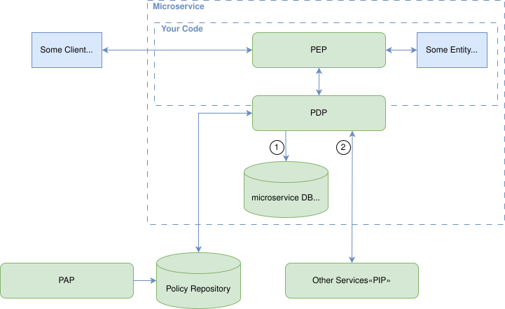

The microservice continues to act as the PEP, calling into the PDP to make access decisions during request handling. To make an authorization decision, the PDP requires attributes, which — depending on the PDP deployment options mentioned above — may either be available within the service or retrieved from external sources (PIPs). Some PDPs support data-fetching logic within the policy itself, allowing them to directly retrieve the necessary attributes at runtime. This is represented by 1 and 2 in the diagram above. Both connections are just an abstraction and denote logic communication paths.

Although this pattern significantly improves the maintainability and consistency of access control logic, it also introduces new challenges and does not resolve all the limitations inherent in the previous pattern. It’s important to note that aspects such as performance, failure resilience, and auditability — including support for "before-the-fact" audit — largely depend on the type of PDP and its integration approach (e.g., embedded, sidecar, or external). These trade-offs are discussed separately in [PDP Deployment & Integration Options](#pdp-deployment--integration-options).

#### Pros

* **Policy governance:** Policies can be centrally defined, versioned, reviewed, and audited, independent of the service’s implementation language.
* **Policy layering:** The model allows for both global (e.g. security team–defined) and local (e.g. service team–defined) policies to coexist. This enables clearer separation of concerns and better alignment with organizational structure and responsibilities.
* **Improved monitoring:** All decisions can be consistently logged and monitored, assuming proper instrumentation.
* **Team autonomy:** Teams remain responsible for their services and their policies, with local enforcement and minimal external dependencies. This aligns well with independent team ownership and domain-driven design principles.
* **Enhanced testability:** Authorization logic can be tested independently of the microservice business logic.

#### Cons

* **Policy distribution complexity:** Policies are now decoupled from the code, so mechanisms are needed to deploy the correct version of each policy to the appropriate service instances.
* **Context sharing:** PDPs do not inherently have access to the microservice context. Developers must design mechanisms to assemble and pass the right attributes into the PDP for evaluation.
* **Coverage gaps:** Some frameworks expose endpoints by default, often without offering hooks for policy enforcement. Teams may also just forget to add the required logic to some endpoints. Combined with poor or misleading documentation, this can result in unintentionally exposed functionality and missed access control. Common examples include health and metrics endpoints (e.g., Spring Boot Actuator), auto-generated documentation routes (e.g., FastAPI or OpenAPI UIs), or static routes in frameworks like e.g. Express.js.
* **Incomplete enforcement observability:** While policy decisions are consistently logged, there’s often no visibility into whether those decisions were correctly enforced across all code paths. Missing instrumentation or scattered enforcement logic makes it difficult to validate effective protection, investigate incidents, analyze system-wide access patterns or detect abuse.

Due to these remaining gaps, "accept by default" behaviors remain a real risk, leading to broken access control vulnerabilities.

### Edge-Level Authorization (Classic)

This pattern aims to address several shortcomings of service-level access control patterns, particularly inconsistent enforcement, policy sprawl, and limited observability. Instead of tying PEP related logic in each service, access control is moved to the system’s perimeter — typically implemented via API gateways, ingress controllers, or reverse proxies.

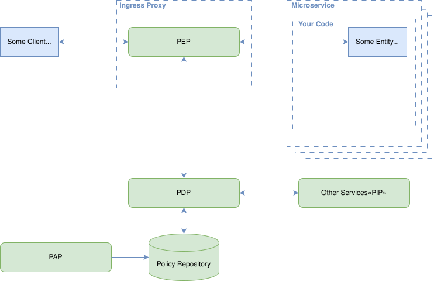

Since authorization must follow authentication, this pattern tightly couples authentication and authorization at the network boundary. Gateways or proxies serve as the PEP, and either evaluate policies locally, using embedded logic, or delegate decisions to an external PDP.

All external traffic flows through the edge component, making this the first pattern that guarantees every inbound request is observed and subject to access control logic. As with the previous pattern, aspects such as performance, failure resilience, and auditability are not covered here but are discussed in [PDP Deployment & Integration Options](#pdp-deployment--integration-options) instead.

#### Pros

* **Consistent enforcement:** All inbound requests pass through a centralized enforcement point, ensuring uniform application of policies and reducing the likelihood of unprotected endpoints ("no accept by default").
* **Policy governance:** Policies can be centrally defined, versioned, reviewed, and audited, independent of the service’s implementation language.
* **Policy layering:** The model allows for both global (e.g. security team–defined) and local (e.g. service team–defined) policies to coexist. This enables clearer separation of concerns and better alignment with organizational structure and responsibilities.
* **Best observability:** All external access attempts are visible and can be logged centrally, supporting effective monitoring, alerting, and forensics.

#### Cons

* **Socio-technical challenges:** In many organizations, API gateways are operated by infrastructure or platform teams, meaning development teams cannot directly manage authorization policies or authentication configurations. This separation of responsibilities requires close coordination between developers and operations/security, which often reduces delivery velocity due to communication and process overhead, especially in complex ecosystems with many roles, evolving access control rules, and the need for flexible authentication flows.
* **Policy distribution complexity:** Policies are decoupled from the code, so mechanisms are needed to deploy the correct version of each policy for the appropriate service instances.
* **Authentication limitations:** Edge components only support a single authentication configuration per listener or route group. Supporting multiple identity providers, per-endpoint authentication flows, or more advanced patterns—such as dynamic consent, step-up authentication, or conditional logic based on subject actions — is difficult or impossible without custom logic or deep integration.
* **Context sharing:** Edge components only have access to request-level attributes (e.g., headers, paths, IPs). This makes it difficult to evaluate fine-grained, object-level, or business-context-sensitive access decisions.
* **Enforcement blind spots and defense-in-depth violations:** Since the edge only governs ingress traffic, any internal traffic (e.g., service-to-service calls) or network misconfigurations may bypass enforcement entirely - violating the defense-in-depth principle and creating a single point of failure.

### Edge-Level Authorization (Modern)

This pattern evolves the classic edge-level authorization approach to overcome its key limitations. While enforcement still occurs at the perimeter via proxies or gateways, this approach allows per-service customization through service-specific rules — declarative definitions of how identity and context are gathered, how authorization is performed, and how decisions are propagated — forming explicit *authorization contracts*. These contracts manifest as structured, signed data (e.g., JWT claims or enriched signed headers) that the edge proxies or gateways relay to downstream services. This explicit propagation of authorization context ensures that internal service-to-service calls rely on a trusted, verifiable authorization boundary, addressing common concerns around enforcement blind spots and defense-in-depth violations typically associated with edge-only models. By making authorization an explicit API-level contract, teams can confidently decentralize enforcement without creating single points of failure or gaps in access control.

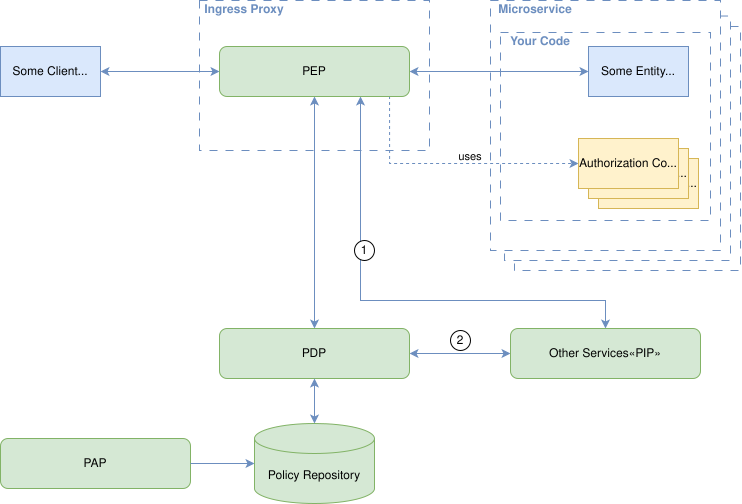

Instead of embedding rigid policy logic or centralizing control in infrastructure teams, this pattern emphasizes composability, autonomy, and observability, enabling each team to define how their endpoints are protected, while still benefiting from centralized governance and enforcement guarantees. As with the previous pattern, aspects such as performance, failure resilience, and auditability are not covered here but are discussed in [PDP Deployment & Integration Options](#pdp-deployment--integration-options) instead.

#### Pros

* **Consistent enforcement:** Uniform application of policies at a centralized point prevents unprotected or overlooked endpoints.
* **Policy governance:** Policies remain versioned, reviewed, and auditable, often authored centrally but can be referenced declaratively in service-specific contracts.
* **Best observability:** All external access attempts are visible and can be logged centrally, supporting effective monitoring, alerting, and forensics.
* **Rapid prototyping:** Through authorization contracts, teams can experiment with different authorization models (e.g., embedded JWT claims, header-based roles, etc.) without relying on the infrastructure components.
* **Context sharing:** The proxy can fetch contextual data from arbitrary PIPs, enabling context-sensitive decisions based on domain-specific attributes, object metadata, or subject state.
* **Service autonomy:** Authorization contracts empower microservice teams to define their own access control needs declaratively, supporting domain-driven service ownership without duplicating enforcement logic.
* **Authorization context propagation:** The system can rewrite identity and authorization responses from the PDP into formats that match each service’s expectations (e.g., structured JWTs, plain or signed headers), decoupling service-specific logic from authorization protocols.
* **Secure by default:** The use of declarative contracts and centralized enforcement reduces misconfiguration risks and prevents implicit access grants.

#### Cons

* **Policy distribution complexity:** Ensuring the correct version of a policy is evaluated in the context of the specific service version requires additional coordination. This mainly depends on PDP capabilities and tooling.
* **Contract governance:** While authorization contracts empower teams with autonomy, it requires clear guidelines and automated validation tools to prevent misconfiguration or misuse.

There is also a variant of this pattern — **"Side-Car-Proxy-Based Authorization"** — where the PEP is deployed alongside the microservice as a dedicated proxy, intercepting and controlling all inbound traffic to that service. This approach shares many of the same advantages and drawbacks as the edge-level model. However, operational complexity increases, as each service gains an additional moving part. Furthermore, observability becomes fragmented, since monitoring is limited to individual services unless all services in a given context adopt the same pattern.

### PDP Deployment & Integration Options

The choice of PDP deployment — embedded, as a sidecar, or external — significantly impacts performance, auditability, and supported authorization models. The table below summarizes the key trade-offs:

| Aspect                | Embedded PDP          | Side-Car PDP              | External PDP                                       |
|-----------------------|-----------------------|---------------------------|----------------------------------------------------|
| Location              | as a library          | as local side-car process | separate PDP service                               |
| Latency               | almost no impact      | very low latency          | higher latency due to network hops                 |
| Before the Fact Audit | limited               | limited                   | possible system wide                               |
| Access Control Models | PBAC, e.g. Casbin     | PBAC, e.g. OPA            | PBAC, ReBAC, and NGAC (e.g. OPA, OpenFGA, SpiceDB) |
| Dependencies          | none (self-contained) | none (self-contained)     | Relies on PDP service availability                 |

#### On Data Source Integration

The need to fetch or inject data required for policy evaluation introduces operational challenges across all authorization patterns — including [Decentralized Service-Level Authorization](#decentralized-service-level-authorization). Depending on the PDP deployment style, this responsibility may lie with the PEP (e.g., a service or edge proxy) or the PDP itself. Accessing PIPs at runtime can complicate network configurations, conflict with segmentation or firewall policies, and broaden the system’s attack surface. These concerns require careful architectural consideration, which is also something the next section aims to support you with.

## Decision Dimensions for Authorization Patterns

The discussion of [Authorization Patterns](#authorization-patterns) might suggest that [Decentralized Service-Level Authorization](#decentralized-service-level-authorization) should be avoided due to drawbacks such as scattered logic and limited auditability. However, this is not always the case. The suitability of an authorization pattern depends on the system context. This context can be analyzed along several key dimensions that guide the choice of appropriate patterns and help keep the system secure, manageable, and responsive, as outlined in this section.

### Policy Characteristics

Policy characteristics define how policies are authored, maintained, and updated, influencing their management and distribution. Two key dimensions, [ownership](#policy-ownership) and [change latency](#policy-change-latency), guide these processes, which are critical for operationalizing authorization systems.

#### Policy Ownership

This dimension identifies who owns and maintains a particular policy. Ownership matters in two ways: it often correlates with how composable or layered the policies need to be, and it also defines governance boundaries, determining who is authorized to create, modify, and deploy policies.

* **Microservice Team:** Policies authored and maintained by the team responsible for a specific microservice. These are typically focused on local enforcement logic and closely tied to internal service semantics. For example, a recommendation service defines request filters that exclude certain products based on internal scoring thresholds or active experiments.
* **Domain Level:** Policies shared across services within a business domain, often requiring coordination between teams. These policies may be abstracted and reused across multiple services, like a subscription domain enforces business rules about grace periods, usage limits, or billing thresholds that are referenced by billing, customer portal, and notification services.
* **Central (Organization Level):** Policies governed by a central security, compliance, or platform team. These typically apply across domains or services and provide the foundation upon which more granular policies are built, like an organizational policy that defines acceptable data residency constraints or standard access conditions for administrative APIs.

#### Policy Change Latency

This dimension describes how quickly a policy change must be reflected in the system once introduced. It should not be confused with the *frequency* of policy changes (how often they occur), or with [input data freshness](#input-data-freshness) (how quickly attribute updates must be reflected in policy decisions). While policy change frequency influences governance and authoring processes, the latency dimension defines how fast policies must be deployed and propagated across services to take effect.

* **Immediate:** Policies must take effect as soon as they are changed (seconds to minutes). Example: A financial system introduces a temporary block on a specific payment method due to detected processing errors. The rule itself (block this method) must be enforced immediately across all services to prevent further transactions.
* **Fast:** Policies should be applied within hours to days. Example: A sales team requests an update to discount eligibility rules for enterprise customers. Once approved and authored, the new policy should be effective by the next business day.
* **Delayed:** Policies can be applied on a longer timescale (weeks or more). Example: A data retention policy update mandated by new legislation is scheduled for enforcement with the next release.

### Policy Distribution Strategies

The [policy change latency](#policy-change-latency) dimension, described in the previous section, defines how quickly policy changes must take effect once introduced. These latency requirements directly influence how policies are delivered to PDPs to ensure they are available for evaluation in the system, which is what this section addresses. Here, we discuss the two primary strategies along with their respective trade-offs.

#### Out-of-Band Delivered Policies

Policies are proactively sent to the PDP and stored locally for evaluation. This strategy suits policies that tend to have immediate to fast change latencies, requiring agile, incremental updates without disrupting service availability.

**Pros:**

* Enables applying policy changes dynamically without redeploying PDPs, supporting high availability.

**Cons:**

* Requires robust synchronization mechanisms to deploy the correct versions of required policies to each PDP instance.
* Demands governance mechanisms to ensure that policy deployment aligns with ownership boundaries. E.g., microservice teams should only be able to update their own policies, while domain or central teams retain control over shared or organizational policies.

This is where [policy ownership](#policy-ownership) becomes a critical factor, as it directly shapes the enforcement and governance model for policies and who is allowed to deploy which one.

#### Embedded Policies

Policies are embedded directly within the PDP (e.g. as code, or as static configuration) and cannot be updated without restarting or redeploying the PDP. This approach is best suited for policies that have delayed change latencies. Stability and operational simplicity are typically prioritized over agility in such cases.

**Pros:**

* Simplifies policy management, as policies are bundled with the PDP.

**Cons:**

* Increases deployment overhead, as changes involve rebuilding and/or redeploying the PDP.
* Limits scalability for needs with frequent policy adjustments.
* Introduces governance challenges, since the team deploying the PDP effectively decides which policies get bundled and activated, even if those policies are owned by different teams or organizational units.

### Data Characteristics

Data characteristics define how information used during policies evaluation is sourced and managed. The first subsections focus on the input side and introduce three key dimensions: [input data locality](#input-data-locality), [input data cardinality](#input-data-cardinality), and [input data freshness](#input-data-freshness). The last subsection covers the characteristics of the output data — the [output data cardinality](#output-data-cardinality).

Locality describes the scope within which data is relevant and shared, cardinality determines how much data must be managed, and freshness defines how often that data must be refreshed or fetched in real time. Taken together, these dimensions shape the feasibility and efficiency of authorization system design.

#### Input Data Locality

Locality defines the boundaries of data relevance and reuse, from tightly scoped to broadly shared:

* **Service-Local Data:** Data relevant only within a single service, not reused elsewhere. For example, service-specific configuration flags affecting authorization decisions only inside that service, or ephemeral session attributes used exclusively by the service’s internal logic.
* **Domain-Level Data:** Data shared across multiple services within the same bounded context or domain. Examples include ownership metadata of documents in a document management domain, customer account status (e.g., frozen, active, under review) used by both billing and support services, or time-based availability windows for booking or scheduling services.
* **Organization-Level Data:** Relevant across domains or the entire system, such as regulatory classification of data (e.g., "EU personal data"), tenant-level subscription tier or plan.

#### Input Data Cardinality

Cardinality refers to the number of distinct attributes across all subjects or resources. It determines how easily data can be cached or distributed in an access control systems.

* **High:** Many distinct data items, often tied to individual requests or users (e.g., a real-time risk score or geoip information).
* **Medium:** Moderate number of distinct data items typically shared across sets of subjects or resources (e.g., project IDs).
* **Low:** Few distinct data items. For example, environment labels (e.g., "production", "staging"), or business unit identifiers (e.g., "HR", "Finance", "R&D").

#### Input Data Freshness

This measures the maximum acceptable delay between an attribute value changing, and that change being reflected in authorization decisions.

* **High:** Changes must be reflected immediately or within seconds to maintain accurate authorization (e.g., real-time risk scores, breach detection flags).
* **Medium:** Changes should be reflected within minutes to hours, balancing freshness and performance (e.g., feature toggles, subscription tiers).
* **Low:** Changes can be reflected with delays of hours to days without significant impact.

#### Output Data Cardinality

As written in the [story section](#a-story-to-ground-the-concepts), policy decisions often include more than just simple `"permit"` or `"deny"` responses. They may carry **structured outputs** that shape the final data set accessible to a subject — such as lists of permitted object IDs, query filters, or advices.

These outputs fall into two broad categories:

* **Metadata**: Optional guidance or instructions to the PEP (e.g., log this access, display a warning).
* **Decision Data**: The core result of policy evaluation — potentially including constraints, and similar information describing what access is allowed.

While the PDP returns the decision, its structure and size — the **output cardinality** — are defined by the **policy logic**, which reflects the needs of the consuming application. For example, if an application must render only the documents a user is allowed to see, the policy may be implemented to return a list of permitted document IDs, increasing output cardinality.

That way, the output cardinality can be grouped into three levels:

* **Low**: Simple decisions with minimal metadata, such as `{ "result": true }` or `{ "decision": "permit" }`.
* **Medium**: Decisions include multiple structured attributes or small lists. Example: `{ "allowed_projects": ["A", "B"] }`.
* **High**: Large or complex result sets, such as thousands of object IDs. These often require pagination or streaming. Example: `{ "resources": ["doc1", "doc2", ..., "doc5000"] }`.

### Policy Input Data Distribution Strategies

While the [input data freshness](#input-data-freshness) dimension defines how quickly data changes must be reflected in access control decisions, [input data cardinality](#input-data-cardinality) can, depending on the PDP type, limit how much information can be stored or cached in practice, and with that also the ability to fully achieve that reflection. This challenge is especially relevant in PBAC systems.

This tension highlights a broader challenge for all approaches relying on embedded or external PDPs: how to make the right data available at evaluation time without overwhelming the system. To address this challenge, different strategies for distributing input data to PDPs have emerged. Each comes with distinct trade-offs, and their suitability depends on the PDP type (e.g., PBAC, ReBAC, NGAC) as well as on system requirements for performance, scalability, and freshness.

Each strategy addresses different operational concerns, and no single approach works universally. Mature systems often combine them, guided by data characteristics, performance targets, and architectural constraints.

#### On-Demand Data Pull

The PDP fetches data from PIPs at the time of policy evaluation, typically via APIs or database queries. PDPs supporting this option typically allow for configurable caching of the pulled data. 

**Pros**

* Ensures [data freshness](#input-data-freshness) by retrieving the latest attributes values from PIPs at evaluation time.
* Enables handling of [high-cardinality](#input-data-cardinality) data without preloading large datasets into the PDP.
* No need for data synchronization mechanisms, since the PDP always queries the source directly.
* Since the PDP does not need to maintain a local copy of data, the memory or storage demand of the PDP is low.
* Governance responsibility is at the policy author — the policy defines where the data is retrieved from.

**Cons**

* Increases latency due to network calls to PIPs during evaluation, which negatively impacts performance, especially for high-throughput systems.
* Introduces dependencies on external systems, reducing resilience if PIPs are slow or unavailable, potentially leading to cascading failures, degraded service or fallback decisions.
* Limits the usable PDP types, as ReBAC and NGAC implementations typically don’t support this strategy.
* Degrades system performance when attributes are accessed repeatedly, especially for high-throughput systems.

While caching (if supported by the PDP) can mitigate some of these drawbacks, it undermines the freshness guarantee, potentially leading to incorrect authorization decisions. Moreover, caching also negates the low-storage advantage listed above — especially for high cardinality data.

#### Out-of-Band Data Push

Data is proactively sent to the PDP in advance, and stored in memory or a local data store for faster access during evaluation.

**Pros**

* Improves performance by storing data locally (e.g., in memory or a local database), enabling faster policy evaluation.
* Enhances resilience, as the PDP can operate independently of PIP availability, allowing PDP instances to remain lightweight and focused on evaluation, which improves their scalability.
* ReBAC/NGAC PDP types typically require access to complete relationship graphs or contextual data sets, which are infeasible to retrieve on-demand or pass inline. This strategy enables those models.
* Reduces load on the PDP by shifting data synchronization to other system components, allowing PDP instances to remain lightweight and focused on evaluation, which improves their scalability.

**Cons**

* Requires robust data synchronization mechanisms to push updates to the PDP instances in real-time or near-real-time, especially for data with [high-freshness](#input-data-freshness) requirements.
* Increases memory or storage demands on the PDP, which is usually problematic for [high-cardinality data](#input-data-cardinality).
* Introduces governance complexity, as mechanisms, who can write to the event/topic the PDP listens to, or who can invoke the PDP’s API for updates, and which specific data each party is allowed to send, must be established.

#### Request-Time Data Injection

Required data is passed directly in the request from the PEP to the PDP — an approach often referred to as *inline data passing*. Early-stage standardization efforts ([OpenID AuthZEN Initiative](https://openid.net/authzen-authorization-api-1-0-implementers-draft-approved/)) aim to make this interaction more consistent and interoperable.

**Pros**

* Ensures [data freshness](#input-data-freshness) by providing the latest attributes values from PIPs.
* Enables handling of [high-cardinality](#input-data-cardinality) data without preloading large datasets into the PDP.
* Reduces load on the PDP by shifting data synchronization to other system components (the PEP), allowing PDP instances to remain lightweight and focused on evaluation, which improves their scalability.
* Since the PDP does not need to maintain a local copy of data, the memory or storage demand of the PDP is low.
* Typically, the only option for ReBAC and NGAC systems to provide attributes which are not stored in their databases.

**Cons**

* Increases request size, as additional data is included in the decision request, potentially impacting network performance.
* Places the burden on the PEP (e.g., microservice or edge component) to collect and validate data from PIPs, increasing complexity in the calling component.
* Risks inconsistent data if the PEP fails to provide all required attributes or if data collection is misconfigured, potentially leading to incorrect decisions.
* Can degrade system performance when attributes are accessed repeatedly by the PEPs.
* Introduces governance complexity, as PEP configuration becomes a concern — it determines which attributes are fetched and sent to the PDP, as changes directly impact authorization decisions.

While caching (if supported by the PEP) can mitigate some of these cons, it introduces the risk of stale data, potentially leading to incorrect authorization decisions.

#### Embedded Data

Data is baked directly into the PDP’s configuration, rather than being pulled or pushed dynamically.

**Pros**

* Zero runtime dependencies on external PIPs — the PDP is fully self-contained, which simplifies deployments.
* No synchronization concerns; the data is always available and consistent.

**Cons**

* Useful for static or rarely changing information only (e.g., "environment": "prod", "region": "EU"), and impractical for medium- or high-freshness data.
* Introduces governance challenges similar to those described in [embedded policies](#embedded-policies), as the team deploying the PDP effectively decides which data get bundled and used, even if those data elements are owned by different teams or organizational units.

### Policy Output Data Handling Patterns

As stated earlier, access control requirements often go beyond simple cases like "can subject X read object Y?". In practice, most requests hitting a PEP involve multiple, context-sensitive decisions. This is especially true for read operations, such as deciding whether to render "edit" or "delete" buttons based on a user's permissions.

These decisions can often be handled via batch requests, where the PEP sends multiple access queries in a single call, and the PDP evaluates them at once, returning one simple decision per item. However, access requests involving larger output data sets, such as for rendering a list of articles Alice is allowed to see, can, depending on the chosen approach, significantly affect [output data cardinality](#output-data-cardinality) and directly influence the choice of the possible [authorization patterns](#authorization-patterns).

The following subsections describe the typical patterns used in such cases.

#### PDP as Filter, aka Brute-Force Lookup

In this pattern, the PEP retrieves all potentially relevant data from a PIP (e.g., a database or API) and iterates over each item, querying the PDP to check whether access is permitted. If allowed, the item is included in the final result (e.g., rendered HTML or returned JSON).

**Pros**

* Simple to implement.
* Works with any PDP.
* Easy to debug and monitor.

**Cons**

* High latency and poor scalability for high-cardinality queries due to repeated PDP calls.
* Increases resource consumption by retrieving more data than needed.
* Tightly couples the PEP with the service’s business logic and makes externalizing the PEP (e.g., into a proxy) impossible.
* Changes to access policies typically require service redeployments or even refactorings.

The first two cons might be partially resolved by making use of batch queries if the PDP supports that.

#### Authorized Data Set

In this pattern, the PEP makes a single request, and the PDP returns a complete set of allowed resources (e.g., object IDs). The PDP constructs this result based on policy logic and available attributes.

**Pros**

* Reduces round-trips by returning all results at once.
* Simplifies PEP logic, as the PDP handles the complexity of determining the authorized dataset.
* Well-suited for ReBAC or NGAC PDPs, which can leverage internal data models to compute permitted resources.
* Externalizing the PEP to e.g., an external proxy is only feasible for low to medium cardinality output data sets.

**Cons**

* Might complicate error handling and monitoring of data access.
* Require pagination or streaming for bigger output data sets.
* Results in complex policies for PDPs implementing PBAC approaches.
* Not supported by every PBAC PDP implementation.

#### Authorization Filter

In this pattern, the PEP calls the PDP, which returns a filter expression (e.g., a SQL WHERE clause, query predicate, or attribute-based condition). The PEP then applies this filter during data retrieval (e.g., in a database query) to fetch only the authorized data.

**Pros**

* Highly efficient for large datasets — filtering happens at the PIP (data source).
* Scales well with high output cardinality.
* Reduces PDP load.
* PDP does not need to not know all data sets.
* Enables flexible PEP placement — as part of the service, or as an external proxy.

**Cons**

* Not supported by every PDP (ReBAC und NGAC PDPs do not support that at all).
* Might complicate error handling, monitoring of data access, and diagnosing related issues.

### Performance

Last but not least, performance plays a critical role in the design of authorization systems — especially in latency-sensitive environments. From the end-user’s perspective, Time to First Byte (TTFB) is one of the most influential metrics, as described in Phil Walton’s article on [user-centric performance metrics](https://web.dev/articles/user-centric-performance-metrics).

TTFB represents the time it takes for the first byte of a response to reach the client and reflects the perceived responsiveness of a system. It implicitly defines the **latency budget** available for upstream processes — including authorization decisions. This concept is further reinforced by the [speed and human perception thresholds](https://hpbn.co/primer-on-web-performance/#speed-performance-and-human-perception) discussed in *[High Performance Browser Networking](https://hpbn.co/)*.

The following factors strongly influence architecture decisions — such as PDP placement and data handling — and directly impact whether the system can meet that latency budget:

* **Policy evaluation latency:** The time a PDP takes to compute a decision depends on the number and complexity of policies and the [input data cardinality](#input-data-cardinality) — i.e., how many attributes must be evaluated.

* **Data retrieval latency:** When attributes are fetched on-demand (see [Policy Input Data Distribution Strategies](#policy-input-data-distribution-strategies)), latency depends on the number of PIPs involved, the volume of data ([input data cardinality](#input-data-cardinality)), and its locality. This can add significant variability to response time.

* **Policy output handling:** The [output data cardinality](#output-data-cardinality) and the selected [output handling pattern](#policy-output-data-handling-patterns) affect the time required to process and apply the result.

* **PDP integration overhead:** Overheads include network latency (ranging from ca. 300µs on loopback to >200ms for cross-region communication), DNS resolution, TLS handshake, and data serialization/deserialization. Protocol choices (e.g., HTTP/1.1 vs. HTTP/2 vs. gRPC) can further influence this. For in-process PDPs, these costs are minimized, though serialization costs may still apply.

* **Runtime resource contention:** ("Busy Neighbor" effect) PDPs are typically CPU- and memory-intensive. Co-located resource-hungry processes can significantly degrade performance if compute and memory isolation aren’t enforced. This is especially relevant when integrating a PDP into an edge component (either embedded or as a sidecar), which is often optimized for high IOPS throughput. In such cases, embedding a PDP introduces trade-offs between CPU-bound policy evaluation and I/O-heavy request processing.

* **Caching and memoization:** Many PDPs implement decision caching or partial evaluation to avoid repeated computation for deterministic inputs. These optimizations can reduce latency but can lead to outdated decisions and require robust cache invalidation logic.

Additional considerations include:

* **Connection reuse and pooling:** Using persistent connections, connection pooling, or multiplexed protocols (like gRPC or HTTP/2) helps amortize integration overhead and reduce connection setup time.

* **Fallback strategies and timeouts:** Systems must decide how to behave when the PDP is slow or unavailable. Strategies such as *fail-closed*, *fail-open*, or *graceful degradation* are architectural decisions that directly impact perceived performance and security posture.

## Practical Considerations & Recommendations

Having covered everything so far, we are now ready to get into the practical part — namely: when do which authorization patterns make sense, how do they influence one another (as relying on just a single pattern rarely works in practice), and what the implications of these choices are in real-world systems.

### Authorization Patterns Recommendations

This subsection maps the [decision dimensions](#decision-dimensions-for-authorization-patterns) to the [authorization patterns](#authorization-patterns) both described earlier, using the trade-offs of the corresponding patterns as the primary guiding principle. While multiple patterns may technically be applicable in a given context, some introduce security, operational, performance, or maintenance overheads that make them less desirable in practice. The recommendations below aim to balance these concerns, helping to avoid common pitfalls and promote architectural consistency. Deviations may be valid in specific cases, but should be intentional — not accidental.

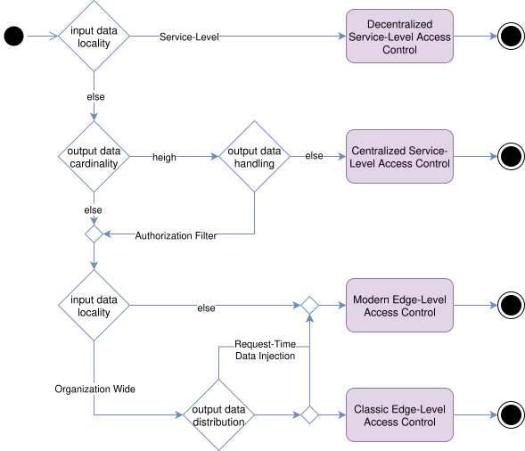

The diagram above illustrates the recommended patterns based on the given dimensions.

* If the [input data locality](#input-data-locality) required for the decision is service-local, [Decentralized Service-Level Authorization](#decentralized-service-level-authorization) is ideal — regardless of other dimensions — since the data’s isolated scope avoids all the drawbacks discussed earlier.

* If the [input data locality](#input-data-locality) extends beyond Service-Local — i.e., the same data is shared across multiple services — and the [output data cardinality](#output-data-cardinality) is high while using [Authorization Filters](#policy-output-data-handling-patterns) is not feasible, then [Centralized Service-Level Access Control](#centralized-service-level-authorization) is better suited to the context.

* In all other cases, [Modern Edge-Level Authorization](#edge-level-authorization-modern) tends to offer the best trade-offs.

* [Classic Edge-Level Authorization](#edge-level-authorization-classic) may still be suitable when input data is organization-wide, output cardinality is low, and all relevant data is either [pulled by the PDP at request time](#on-demand-data-pull) at request time or [pushed to the PDP out-of-band](#out-of-band-data-push) in advance.

**Note:** Pattern selection is not an isolated decision. The described patterns form a broader pattern language, where one pattern often implies or necessitates the use of another. For instance, selecting [Modern Edge-Level Authorization](#edge-level-authorization-modern) introduces the concept of an "authorization contract", which must be verified within each service. These contracts represent service-local data, and verifying them naturally leads to adopting [Decentralized Service-Level Authorization](#decentralized-service-level-authorization) inside the respective services.

**Example: The Blog Platform**

To illustrate how multiple authorization patterns may compose into a coherent solution, let’s return to the [earlier story of Alice and the blog platform](#a-story-to-ground-the-concepts).

The system defines two access requirements:

* **Listing articles:** Every user is allowed to see the list of available articles, including the title, publication date, author, and a short excerpt.
* **Reading articles:** Access to the full content depends on the user’s subscription level and the number of full articles already read that day.

These requirements map naturally to different authorization patterns:

* For listing articles, the access logic relies solely on local data stored within the article service. Since the input data is entirely service-local, the [Decentralized Service-Level Authorization](#decentralized-service-level-authorization) pattern is ideal — no orchestration or coordination with other services is required.
* Reading a full article, however, requires accessing data managed by multiple services: the subscription service (to verify Alice’s plan) and a usage-tracking service (to check her daily quota). Because the input data is not local and the output cardinality is low — the system makes a decision about a single article — [Modern Edge-Level Authorization](#edge-level-authorization-modern) is a better fit. The payload of the "authorization contract" introduced here might, for example, look like:
`{ "requested_article": "<uuid>", "allowed_representation": "<full | excerpt>" }`,
which then leads to verifying this contract within the article service using [Decentralized Service-Level Authorization](#decentralized-service-level-authorization).

**Example: A Document Management System**

Let’s now shift the service landscape slightly to explore the applicability of the remaining patterns. Imagine Alice now wants to access her employer’s document management system.

* **Listing documents:** Users can only list documents related to the projects, they are a team member of
* **Reading documents:** Users can only read documents related to the projects, they are a team member of

These map to the following patterns:

* Listing documents requires access to the project members service. Given the typically high output cardinality, [Centralized Service-Level Authorization](#centralized-service-level-authorization) is the best fit.
* While reading a document could use the same pattern, [Modern Edge-Level Authorization](#edge-level-authorization-modern) is a better fit. It simplifies the implementation of the document-rendering service and ensures that all exposed endpoints — not just the document delivery one — are consistently subject to access control.

Last but not least, the [performance](#performance) requirements and [input data cardinality](#input-data-cardinality) strongly influence the PDP choice — PBAC, ReBAC, or NGAC — and integration approach — embedded vs. external. However, this decision may also be shaped by the available tooling for [policy](#policy-distribution-strategies) and [policy input data](#policy-input-data-distribution-strategies) distribution — which brings us to the next section.

### Data and Policy Distribution in Practice

Building on the concepts introduced in [Policy Input Data Distribution Strategies](#data-distribution-strategies) and [Policy Distribution Strategies](#policy-distribution-strategies), this section demonstrates how the [out-of-band data push](#out-of-band-data-push) and [out-of-band delivered policies](#out-of-band-delivered-policies) approaches translate into concrete architectures for real-world PDP deployments. These architectures — whether based on embedded PDPs or standalone PDP services — incorporate specific control-plane components to manage initialization, configuration, and runtime updates, ensuring that PDPs remain synchronized and deliver accurate authorization decisions in dynamic environments.

These control-plane components are:

* **Configuration Repository:** Stores the desired configuration for each PDP instance, including detailed references to required policies — such as their repository locations and version information — as well as PIP integration settings, including endpoints, supported protocols, credentials, and other communication-specific parameters.
* **Distributor:** A control-plane component responsible for distributing configuration that enables Aggregators to obtain and apply data and policy artifacts. It retrieves configuration from the Configuration Repository and monitors it for changes. Whenever an Aggregator connects or updated configuration becomes available, the Distributor pushes the applicable configuration to that Aggregator. Depending on the implementation, it may also act as a relay for data updates from PIPs, forwarding only the relevant updates to each Aggregator based on their configured subscriptions.
* **Aggregator:** A control-plane component responsible for configuring a PDP instance with the required policies and data. The Aggregator acts as a client of the Distributor, connecting to it to receive its configuration and any updates. Based on this configuration, it retrieves policies and data from designated sources — policy repositories for policies and PIPs for data — and monitors these sources to ensure the PDP remains synchronized with the desired state. Monitoring of policies depends on the capabilities of the policy repository and typically involves polling. For data updates, Aggregators may either pull directly from PIPs or receive change notifications via decoupled mechanisms such as message buses or webhooks. Event-based delivery is often preferred due to its scalability and resilience, but it's not strictly required.

The following setup illustrates this approach, showing how a PDP can be provisioned with policies and data while supporting runtime updates.

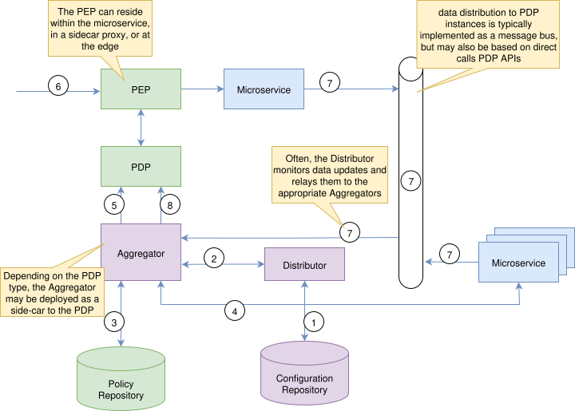

1. The Distributor starts, retrieves configurations from the Configuration Repository, and waits for Aggregator connections.
2. An Aggregator starts, connects to the Distributor, and receives its configuration.
3. The Aggregator pulls policies from the specified Policy Repository.
4. It fetches initial data sets from the designated PIPs.
5. The Aggregator configures the PDP with the retrieved policies and data.
6. When a PEP intercepts a request, it queries the PDP for an authorization decision. If the request is allowed and forwarded to the microservice, it may result in updates to microservice-managed data.
7. Resulting update events are sent to the event distribution system and received by the interested Aggregators.
8. Aggregator updates the PDP’s data sets accordingly.

Similar setups have been successfully adopted in large-scale production environments. For example, Netflix presented a comparable design at KubeCon 2017 ([video](https://www.youtube.com/watch?v=R6tUNpRpdnY), [slides](https://conferences.oreilly.com/velocity/vl-ca-2018/public/schedule/detail/66606.html)). Their terminology differs slightly: the component shown as *Aggregator* in the diagram above is called the "AuthZ Agent", and instead of letting each agent independently collect required data, Netflix introduced a central "Super PIP" (which they call the "Aggregator") positioned between the event distribution system and the agents. This component preprocesses and routes relevant data updates, while the AuthZ Agents remain responsible for configuring and updating the embedded PDP instances.

An open-source project that implements a similar architecture is [OPAL - Open Policy Administration Layer](https://github.com/permitio/opal), which allows managing [OPA](https://www.openpolicyagent.org/) and [Cedar-Agent](https://github.com/permitio/cedar-agent) instances. Compared to the diagram above, OPAL delegates responsibility for relaying data updates to the *Distributor*, which pushes relevant changes to each *Aggregator* instance.

**Note:** Although both examples above use PBAC PDP engines, the architectural principles described here are not specific to PBAC engines. The control-plane components — configuration repository, distributor, and aggregator — as well as the mechanisms for policy and data provisioning, apply equally to other PDP types, such as ReBAC and NGAC. Unlike PBAC PDPs, which typically store policies and data only in memory, ReBAC and NGAC PDPs maintain persistent storage. In such deployments, the distributor is typically implemented as a CI/CD pipeline to handle automated provisioning and policy updates and does not manage runtime data updates.

This [out-of-band data push](#out-of-band-data-push) approach introduces an important challenge: Consider a microservice (e.g., Service A) that updates its own database after a successful request and emits a corresponding [domain event](https://microservices.io/patterns/data/domain-event.html) intended to notify PDP-related infrastructure (some of the interested Aggregators via an event bus). If the event is lost, delayed, or not processed correctly, the PDP’s internal state may become outdated. As a result, future authorization decisions — possibly in other services — may be based on stale or incomplete data, leading to incorrect access grants or denials.

This situation reflects a classic **distributed transaction problem**: changes in the microservice and the state change in the PDP must eventually converge, but there's no atomic commit across both systems. Since traditional distributed transactions are often impractical or undesirable in such architectures, solutions may range from simple reliable event delivery mechanisms, like [Transactional Outbox](https://microservices.io/patterns/data/transactional-outbox.html) to more sophisticated patterns like [Saga](https://microservices.io/patterns/data/saga.html) if acknowledgement of event delivery is required.

### Policy Input Data Governance

As in the previous section, this section builds on the concepts introduced in [Policy Input Data Distribution Strategies](#policy-input-data-distribution-strategies), but focuses on challenges common to all strategies that were not addressed earlier:

* **Structural and semantic consistency:** ensuring that supplied data matches the assumptions encoded in policies, such as the existence of user identifiers, values for resource ownership, etc., as a renaming of a field, change of type, or omission of an attribute may prevent policies from being evaluated correctly, creating the risk of incorrect authorization decisions.
* **Consumer visibility and coordination:** knowing which policies depend on which attributes so that producers can coordinate safely with policy owners before making schema or semantic changes.

These challenges are inherent to distributed architectures. Whether in Big Data pipelines spanning multiple data sources and transformations, or if multiple microservices are communicating to each other to execute some business function, in both domains, data or messages can break consumers if schemas or semantics change unexpectedly, and accountability for who relies on which data is unclear.

To address this, explicit agreements — often called **data contracts** in Big Data domain or **consumer contracts** in microservice architectures — codify the shared expectations between producers and consumers and define the "API of data" being exchanged. These types of contracts typically define schema, semantics, and quality guarantees, and also provide mechanisms for coordinated change management.

Adapting the same principles to authorization architectures bring similar benefits: 

* **Communicating the Data API**: Contracts act as a shared reference between PIPs (data producers) and policy authors, clarifying which attributes are required and how they are structured. 
* **Protecting Consumer Expectations**: Contracts can include domain constraints, value ranges, or other guarantees, helping policy assumptions remain valid as data evolves. 

That would also ensure that data supplied to PDPs — whether [pulled on-demand](#on-demand-data-pull), [pushed out-of-band](#out-of-band-data-push), or [passed inline](#request-time-data-injection) — is complete, correctly typed, and semantically valid before reaching the PDP.

Standards such as the emerging [Open Data Contracts Standard](https://bitol-io.github.io/open-data-contract-standard/v2.2.2/home/) provide structured ways of defining such contracts, while related tooling like the [Data Contract CLI](https://cli.datacontract.com/) supports validation and can also be used for enforcement. Alternatively, open-source governance platforms such as [Apache Atlas](https://atlas.apache.org/) can be adapted to manage metadata, lineage, and schema evolution, or tools like [Pact](https://pact.io/) can serve as a practical step toward implementing such contracts by codifying consumer expectations and validating producer behavior — all helping ensure that exchanged data meets structural and semantic requirements.

### Interplay Between Authorization, Authentication, Identity Propagation Patterns, and Zero Trust

Authentication (who you are), authorization (what you're allowed to do), and identity propagation (how the results of authentication are securely carried forward) each address distinct concerns, yet they are deeply interconnected. The usage of one affects the requirements of the others, and vice versa. And only by aligning them consistently can identity, access, and trust be continuously verified and enforced across the system. As a natural consequence, the system as a whole comes to embody the principles of Zero Trust:

* **Never trust by default**: Treat every request as untrusted, even inside the same network perimeter.
* **Always verify everything**: Continuously and adaptively authenticate and authorize all requests, taking real-time signals, like  user behavior or device state into account.
* **Least privilege**: Grant subjects, be it a user, device, or e.g. a service, only the permissions they need, minimizing attack surface.
* **Micro-segmentation**: Divide networks and systems into isolated micro zones to limit lateral movement.
* **Assume breach**: Operate as if attackers are already inside - monitor, log, and audit continuously.
* **Protect data**: Strongly encrypt sensitive information in transit and at rest to ensure confidentiality and integrity.

* [Service-Level Embedded Authentication](#service-level-embedded-authentication) limits the usage of authorization patterns to [Decentralized Service-Level Access Control](#decentralized-service-level-access-control) only and makes it impossible to implement [identity propagation](#identity-propagation-patterns) in a secure way — what a particular principal is, is only defined in the context of a particular service. This is also the reason, why Centralized Service-Level Access Control with [embedded](#centralized-service-level-access-control-with-embedded-pdp) or [external PDP](#centralized-service-level-access-control-with-external-pdp) is impractical. Both expect it to be a shared definition within a given system context. Can be combined with [Edge-Level Authentication](#edge-level-authentication) and [Service-Level Proxy-Mediated Authentication](#service-level-proxy-mediated-authentication) to support workload authentication. 

* [Service-Level Code-Mediated Authentication](#service-level-code-mediated-authentication) extends the authorization options beyond those possible for Service-Level Embedded Authentication. It enables the usage of Centralized Service-Level Access Control with [embedded](#centralized-service-level-access-control-with-embedded-pdp) and [external PDP](#centralized-service-level-access-control-with-external-pdp). Possible secure [identity propagation patterns](#identity-propagation-patterns) are limited to [External Identity Propagation](#external-identity-propagation) and [Token Exchange-Based Identity Propagation](#token-exchange-based-identity-propagation). The former is not always feasible, especially when asynchronous communication patterns are used for inter-service communication. And the latter increases the complexity and maintenance of the particular services. Support for multi-principal subjects as described in [On Subject, Principals and Identities](#on-subjects-principals-and-identities) section is typically hard to achieve as most of the existing frameworks used to implement Service-Level Embedded Authentication don't support this and require custom code. Can be combined with [Edge-Level Authentication](#edge-level-authentication) and [Service-Level Proxy-Mediated Authentication](#service-level-proxy-mediated-authentication) to support workload authentication.

* [Service-Level Proxy-Mediated Authentication](#service-level-proxy-mediated-authentication) is similar to [Service-Level Code-Mediated Authentication](#service-level-code-mediated-authentication) regarding [identity propagation](#identity-propagation-patterns) and authorization options, extends the latter however to the support of [Edge]

#### Zero Trust and Authentication Patterns

Zero Trust requires robust, continuous authentication mechanisms that verify identity at every step. The following authentication patterns are particularly relevant:

* [Service-Level Proxy-Mediated Authentication](#service-level-proxy-mediated-authentication): By offloading authentication to a sidecar proxy, this pattern can enforce consistent authentication policies across services. It also supports workload identity systems like SPIFFE/SPIRE, which provide cryptographically verifiable identities for services, also supporting mutual TLS authentication. This ensures that only authenticated services can communicate, a key requirement in Zero Trust.

* [Edge-Level Authentication](#edge-level-authentication): Centralizing authentication at the system boundary (e.g., via an API gateway) aligns with Zero Trust by providing a single point of control for verifying identity before requests enter the system. When combined with [Protocol-Agnostic Identity Propagation](#protocol-agnostic-identity-propagation), internal services can independently verify identity without blindly trusting upstream components, fulfilling the "always verify" principle.

* [Kernel-Level Authentication](#kernel-level-authentication): This pattern enforces authentication at the transport layer using cryptographic identities (e.g., via IPSec or WireGuard). It provides strong workload identity verification, ensuring that only authenticated services can establish connections. This is a foundational element of Zero Trust networking, as it secures service-to-service communication without relying on network topology.

#### Identity Propagation in Zero Trust

In Zero Trust architectures, identity propagation must be tamper-proof and independently verifiable by each service. The following identity propagation patterns are particularly suited for Zero Trust:

* [Protocol-Agnostic Identity Propagation](#protocol-agnostic-identity-propagation): By transforming external authentication data into a normalized, signed token at the edge, this pattern ensures that internal services can verify identity without relying on external systems. The cryptographic signature provides strong integrity guarantees, preventing tampering or spoofing.

* [Token Exchange-Based Identity Propagation](#token-exchange-based-identity-propagation): Using mechanisms like OAuth2 Token Exchange, services can obtain scoped, short-lived tokens for downstream calls. This limits the exposure of long-lived credentials and ensures that each service interaction is authorized based on the current context.

#### Authorization Patterns in Zero Trust Contexts

The previously discussed [Authorization Patterns Recommendations](#authorization-patterns-recommendations) inherently align with Zero Trust principles — including **least privilege**, **continuous identity verification**, and **context-aware access control**. Rather than introducing Zero Trust as a separate concern, these architectural patterns enforce its core tenets by design.

Here’s how the recommended patterns contribute to a Zero Trust architecture:

* **Decentralized Service-Level Access Control** enables decisions close to the data using strictly local and verifiable context, minimizing reliance on implicit trust.
* **Centralized Service-Level Access Control** (with embedded or external PDP) allows consistent enforcement across services using shared identity and context, while supporting dynamic and centrally managed policies.
* **Modern Edge-Level Access Control** applies authorization at the perimeter and issues verifiable contracts, reducing internal trust assumptions and ensuring consistent downstream enforcement.

These patterns, when used in combination, provide a flexible foundation for implementing Zero Trust in distributed systems.

#### Best Practices

To successfully implement Zero Trust across distributed systems:

* Design for Layered Identity Verification: Use consistent, protocol-agnostic identity propagation and cryptographic verification to enable independent trust decisions across services.
* Favor Central Authentication: When feasible, centralize authentication to improve consistency, observability, and incident response.
* Choose Authorization Patterns Based on System Needs: Weigh security, latency, scalability, and operational complexity when deciding between edge-level, service-level, or centralized models.
* Implement Auditing and Monitoring: Logging, traceability, and anomaly detection are essential to enforce and verify Zero Trust assumptions over time.

### Mapping Product Features

How specific OSS projects map to these architectural setups (e.g., how OPAL + OPA can realize the embedded PDP model with event-based updates, how heimdall can be used to implement reliable edge-level authn&z approaches, ...)

### Common Pitfalls and Best Practices

TODO: guidance on avoiding common mistakes (e.g., "accept by default" behaviors, misconfigured proxies) and implementing best practices for secure authentication and authorization

**Domain-Level Data and Organization-Level Data with Medium or Low Cardinality**

* **Recommended Pattern:** [Centralized Service-Level Access Control with Embedded PDP](#centralized-service-level-access-control-with-embedded-pdp), or [External PDP](#centralized-service-level-access-control-with-external-pdp), or [Modern Edge-Level Authorization](#edge-level-authorization-modern). These patterns ensure consistent enforcement and auditability across shared data scopes.
* **Data Distribution Strategy:** [on-demand data pull](#on-demand-data-pull) or [out-of-band data push](#out-of-band-data-push) are suitable. Both approaches ensure freshness of data, with out-of-band data push also optimizing performance by storing it locally in the PDP eagerly.
* **Considerations:** Embedded PDPs reduce latency, while external PDPs, such as those implementing ReBAC approaches, support advanced capabilities, such as before-the-fact-audit. [Out-of-band data push](#out-of-band-data-push) requires synchronization pipelines, and [on-demand data pull](#on-demand-data-pull) needs robust PIP availability handling.

**Domain-Level Data and Organization-Level Data with High Cardinality**

* **Recommended Pattern:** [Centralized Service-Level Access Control with Embedded PDP](#centralized-service-level-access-control-with-embedded-pdp), or [External PDP](#centralized-service-level-access-control-with-external-pdp), or [Modern Edge-Level Authorization](#edge-level-authorization-modern). These patterns handle complex, shared data while supporting dynamic attribute inclusion.
* **Data Distribution Strategy:** If [Centralized Service-Level Access Control with Embedded PDP](#centralized-service-level-access-control-with-embedded-pdp) is used, [Request-time data injection](#request-time-data-injection) is essential, as high-cardinality data cannot be fully preloaded due to PDP memory limits, so the PEP must collect attributes from PIPs and include them in the decision request. ReBAC, or NGAC PDP implementations typically address that limitation and can be used as [External PDP](#centralized-service-level-access-control-with-external-pdp). In that case, [out-of-band data push](#out-of-band-data-push) approach can be used.
* **Considerations:** In centralized models, microservices (as PEPs) handle PIP integration, increasing complexity. In edge-level models, the edge layer manages data enrichment, simplifying microservices but requiring robust edge configuration. Request-time injection ensures scalability but demands reliable PEP data collection.

